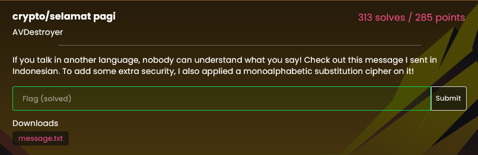

# selamat pagi

Challenge description:



Cipher:

```text
Efe kqkbkx czwkf akfs kdkf qzfskf wzdcjtfk
Ieqku kqk akfs ikxj kck akfs wkak ukikukf :Q
Lzfqztk ukdj kqk qe wefe: bkvim{wzbkdki_ckse_kckukx_ukdj_wjuk_kfkbewew_mtzujzfwe}
```

It uses monoalphabetic substitution on it, i knew it was on Indonesian by the description of the challenge. And i knew that "bkvim" meant "lactf", from there i kept guessing the other 21 correct letters to substitue in the alphabet by guessing the valid words it could be in Indonesian.

For example: in 'kqk' i knew that 'k' = 'a', so i needed to find Indonesian words like 'a?a'. Found 'ada' 'apa' 'aja', then 'q' could mean 'd', 'p' or 'j', from then keep switching letters and finding valid words. If it doesnt exists you guessed wrong, go back on the branch and use the next valid letter to switch.

Then after switching almost all characters, google translate auto complete the words, and i got to the solution:

```text
Ini adalah pesan yang aman dengan sempurna
Tidak ada yang tahu apa yang saya katakan :D
Bendera kamu ada di sini: lactf{selamat_pagi_apakah_kamu_suka_analisis_frekuensi}
```

`lactf{selamat_pagi_apakah_kamu_suka_analisis_frekuensi}`
