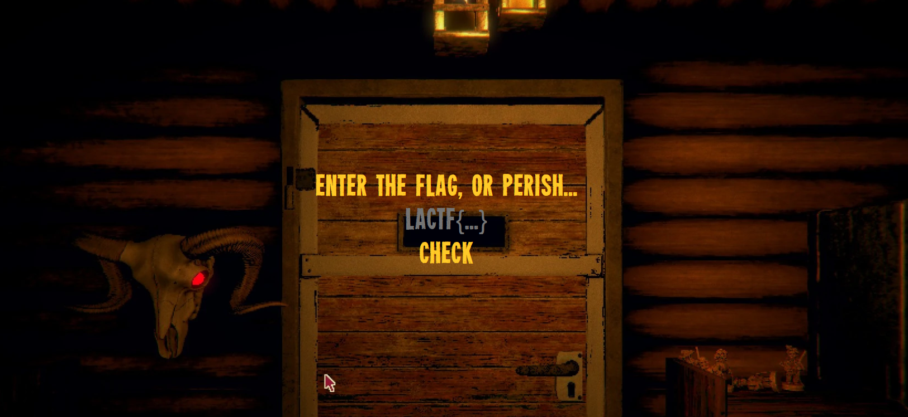

# WriteUp: javascryption
## Descrição do Desafio
**Categoria**: rev

**Descrição**:
> You wake up alone in a dark cabin,
> 
> held captive by a bushy-haired man
> 
> demanding you submit a "flag" to leave.
> 
> Can you escape?
> 
> https://javascryption.chall.lac.tf/

## Solução
O desafio disponibiliza apenas um site. Entrando no site vemos o seguinte.



Podemos ver que é um site que você digita a flag e o site fala se a flag está correta ou não. Olhando o código fonte do site (cabin.js), podemos encontrar a seguinte função:

```js
function checkFlag(flag) {
    const step1 = btoa(flag);
    const step2 = step1.split("").reverse().join("");
    const step3 = step2.replaceAll("Z", "[OLD_DATA]");
    const step4 = encodeURIComponent(step3);
    const step5 = btoa(step4);
    return step5 === "JTNEJTNEUWZsSlglNUJPTERfREFUQSU1RG85MWNzeFdZMzlWZXNwbmVwSjMlNUJPTERfREFUQSU1RGY5bWI3JTVCT0xEX0RBVEElNURHZGpGR2I=";
}
```
Essa é a função que recebe o input do usuário e diz se corresponde a flag. Como se trata de operações simples, podemos apenas começar da última linha e ir revertendo as operações realizadas. A seguir, há um script
que reverte essa função.
```js
    let flag = "JTNEJTNEUWZsSlglNUJPTERfREFUQSU1RG85MWNzeFdZMzlWZXNwbmVwSjMlNUJPTERfREFUQSU1RGY5bWI3JTVCT0xEX0RBVEElNURHZGpGR2I=";
    flag = atob(flag);
    flag = decodeURIComponent(flag);
    flag = flag.replaceAll("[OLD_DATA]", "Z");
    flag = flag.split("").reverse().join("");
    flag = atob(flag);
    console.log(flag);
```
Rodando esse script, obtemos a flag.

### Flag: `lactf{no_grizzly_walls_here}`

## Autor da WriteUp
[Membro de Exploitation - CaioMendesRRosa](https://github.com/CaioMendesRRosa)

