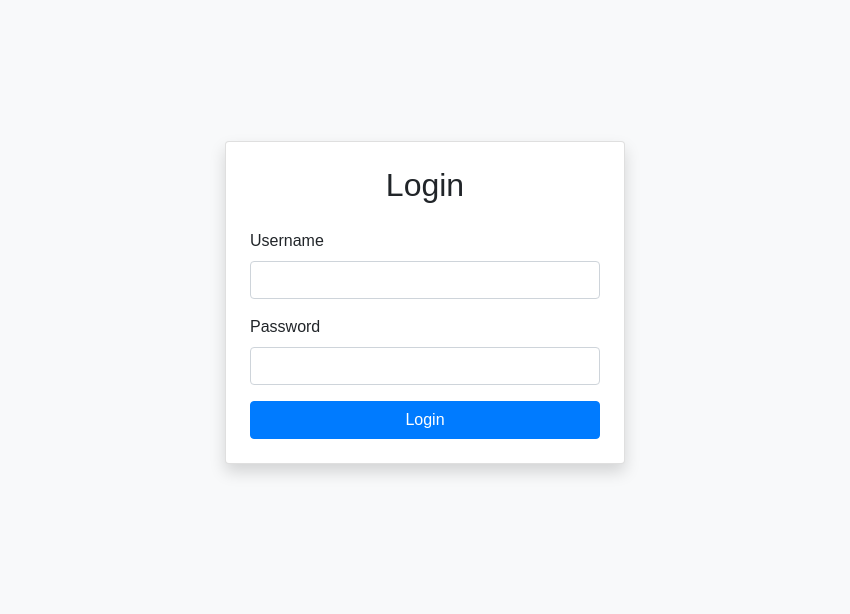
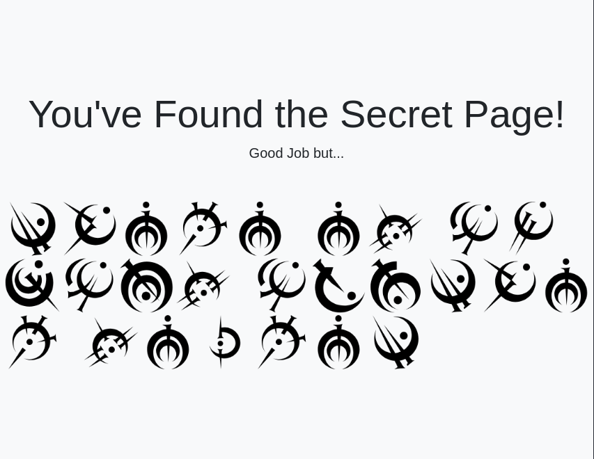
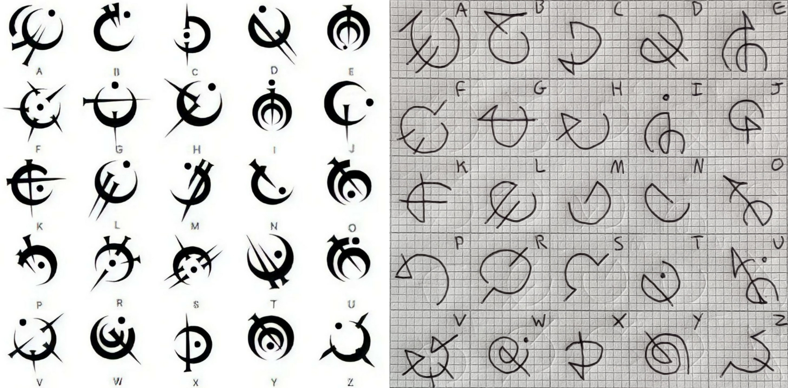

# My First Secret

*A simple login page can you get past it? And remember there are secrets you will have to figure out. After you find the flag remember that the format is TUCTF{(FLAG)} and the if the flag has spaces use _ instead when submitting.*

- *Web Exploitation*
- *Autor do writeup: [@jackskelt](https://github.com/jackskelt)*

O desafio consiste em SQL Injection e uma parte de decifrar. Ao entrar no site, deparamos com uma tela de login. Podemos tentar fazer um SQLi no usuário `admin`.
- Login: `admin`
- Senha: `' OR true=true;--`



Assim conseguimos acesso à página secreta. Ela nos mostra uma imagem com alguns símbolos dispostos de maneira regular, que me parece uma mensagem em algum alfabeto diferente.



Ao pesquisar essa imagem na internet, é possível descobrir que se trata do [Steel Alphabet](https://coppermind.net/wiki/Steel_alphabet), um alfabeto criado nas novelas de Brandon Sanderson. O alfabeto original tem 24 símbolos, onde as letras `E`/`I` compartilham o mesmo símbolo, assim como as letras `O`/`U`.



Decifrando a mensagem, chegamos na frase *"there is always another secret"*. Agora só precisamos seguir as instruções da descrição e chegamos na flag.

```
TUCTF{there_is_always_another_secret}
```