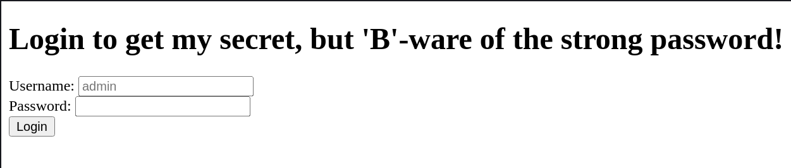
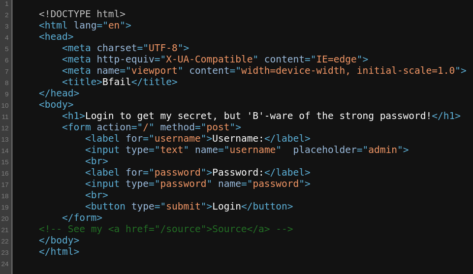
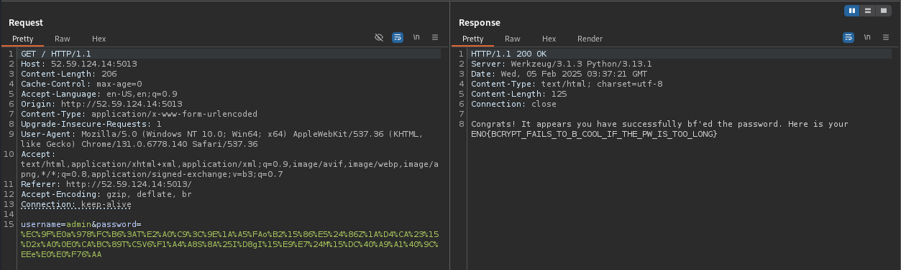

# Bfail

*To 'B' secure or to 'b' fail? Strong passwords for admins are always great, right?*

- *Autor do writeup: [@jackskelt](https://github.com/jackskelt)*
- *Autor do desafio: [@gehaxelt](https://github.com/gehaxelt)*

> Você pode acessar os arquivos do desafio no nosso repositório
> <https://github.com/HawkSecUnifei/Writeups>


Ao acessa a página, nos deparamos com uma tela de login.



Olhando o código da página renderizada, vemos que há um comentário dizendo que podemos acessa o código fonte.





```py
from flask import Flask, request, redirect, render_template_string
import sys
import os
import bcrypt
import urllib.parse

app = Flask(__name__)
app.secret_key = os.urandom(16);
# This is super strong! The password was generated quite securely. Here are the first 70 bytes, since you won't be able to brute-force the rest anyway...
# >>> strongpw = bcrypt.hashpw(os.urandom(128),bcrypt.gensalt())
# >>> strongpw[:71]
# b'\xec\x9f\xe0a\x978\xfc\xb6:T\xe2\xa0\xc9<\x9e\x1a\xa5\xfao\xb2\x15\x86\xe5$\x86Z\x1a\xd4\xca#\x15\xd2x\xa0\x0e0\xca\xbc\x89T\xc5V6\xf1\xa4\xa8S\x8a%I\xd8gI\x15\xe9\xe7$M\x15\xdc@\xa9\xa1@\x9c\xeee\xe0\xe0\xf76'
app.ADMIN_PW_HASH = b'$2b$12$8bMrI6D9TMYXeMv8pq8RjemsZg.HekhkQUqLymBic/cRhiKRa3YPK'
FLAG = open("flag.txt").read();

@app.route('/source')
def source():
    return open(__file__).read()

@app.route('/', methods=["GET"])
def index():

    username = request.form.get("username", None)
    password = request.form.get("password", None)

    if username and password:

        username = urllib.parse.unquote_to_bytes(username)
        password = urllib.parse.unquote_to_bytes(password)

        if username != b"admin":
            return "Wrong user!"

        if len(password) > 128:
            return "Password too long!"

        if not bcrypt.checkpw(password, app.ADMIN_PW_HASH):
            return "Wrong password!"

        return f"""Congrats! It appears you have successfully bf'ed the password. Here is your {FLAG}"""
    
    # Use f-string formatting within the template string
    template_string = """
    <!DOCTYPE html>
    <html lang="en">
    <head>
        <meta charset="UTF-8">
        <meta http-equiv="X-UA-Compatible" content="IE=edge">
        <meta name="viewport" content="width=device-width, initial-scale=1.0">
        <title>Bfail</title>
    </head>
    <body>
        <h1>Login to get my secret, but 'B'-ware of the strong password!</h1>
        <form action="/" method="post">
            <label for="username">Username:</label>
            <input type="text" name="username"  placeholder="admin">
            <br>
            <label for="password">Password:</label>
            <input type="password" name="password">
            <br>
            <button type="submit">Login</button>
        </form>
    <!-- See my <a href="/source">Source</a> -->
    </body>
    </html>
    """

    return render_template_string(template_string)

if __name__ == '__main__':
   app.run(debug=False, host="0.0.0.0", port="8080", threaded=True)
```



O código nos revela 71 bytes da senha do usuário admin, que foi criada utilizando a função de hash do bcrypt. O hash do bcrypt tem 72 bytes, logo temos que descobrir somente o último byte da senha. Para isso, testamos as 256 possibilidades, passamos pela função de hash e comparamos com o hash da senha que temos.



```py
import bcrypt
import itertools
import urllib.parse

# Leaked first 71 bytes of the random password (from the challenge comment)
leaked_prefix = b'\xec\x9f\xe0a\x978\xfc\xb6:T\xe2\xa0\xc9<\x9e\x1a\xa5\xfao\xb2\x15\x86\xe5$\x86Z\x1a\xd4\xca#\x15\xd2x\xa0\x0e0\xca\xbc\x89T\xc5V6\xf1\xa4\xa8S\x8a%I\xd8gI\x15\xe9\xe7$M\x15\xdc@\xa9\xa1@\x9c\xeee\xe0\xe0\xf76'
print("Leaked prefix length:", len(leaked_prefix))

# The stored bcrypt hash for the admin user (only the first 72 bytes of the input matter)
target_hash = b"$2b$12$8bMrI6D9TMYXeMv8pq8RjemsZg.HekhkQUqLymBic/cRhiKRa3YPK"

found_password = None

# Iterate over all possible combinations for the 1 missing byte
for suffix in itertools.product(range(256)):
    candidate = leaked_prefix + bytes(suffix)
    if bcrypt.checkpw(candidate, target_hash):
        found_password = candidate
        print("Found password:", candidate)
        print("URL encoded: ", urllib.parse.quote(candidate))
        break

if not found_password:
    print("Password not found!")
```



```bash
$ python exploit.py
Leaked prefix length: 71

Found password: b'\xec\x9f\xe0a\x978\xfc\xb6:T\xe2\xa0\xc9<\x9e\x1a\xa5\xfao\xb2\x15\x86\xe5$\x86Z\x1a\xd4\xca#\x15\xd2x\xa0\x0e0\xca\xbc\x89T\xc5V6\xf1\xa4\xa8S\x8a%I\xd8gI\x15\xe9\xe7$M\x15\xdc@\xa9\xa1@\x9c\xeee\xe0\xe0\xf76\xaa'
URL encoded:  %EC%9F%E0a%978%FC%B6%3AT%E2%A0%C9%3C%9E%1A%A5%FAo%B2%15%86%E5%24%86Z%1A%D4%CA%23%15%D2x%A0%0E0%CA%BC%89T%C5V6%F1%A4%A8S%8A%25I%D8gI%15%E9%E7%24M%15%DC%40%A9%A1%40%9C%EEe%E0%E0%F76%AA
```

Agora podemos pegar a senha codificada para URL e fazer uma requisição form com `GET` passando `username=admin` e `password=%EC%9F%E0a%978%FC%B6%3AT%E2%A0%C9%3C%9E%1A%A5%FAo%B2%15%86%E5%24%86Z%1A%D4%CA%23%15%D2x%A0%0E0%CA%BC%89T%C5V6%F1%A4%A8S%8A%25I%D8gI%15%E9%E7%24M%15%DC%40%A9%A1%40%9C%EEe%E0%E0%F76%AA`, assim obtendo a flag

```
ENO{BCRYPT_FAILS_TO_B_COOL_IF_THE_PW_IS_TOO_LONG}
```

