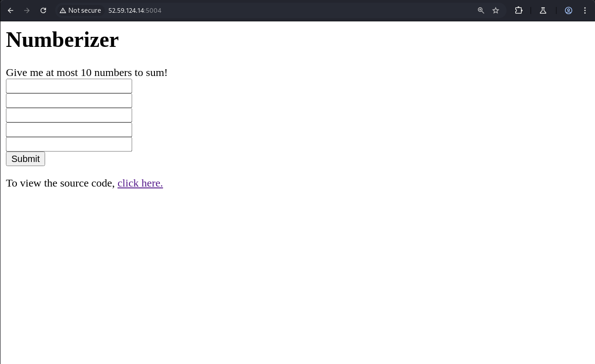
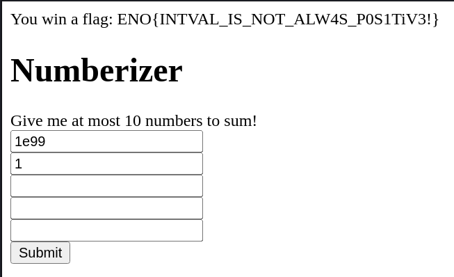

# Numberizer

*Are you good with numbers?*

- *Autor do writeup: [@jackskelt](https://github.com/jackskelt)*
- *Autor do desafio: [@gehaxelt](https://github.com/gehaxelt)*


> Você pode acessar os arquivos do desafio no nosso repositório
> <https://github.com/HawkSecUnifei/Writeups>


Na página inicial podemos ver o código fonte da página





```php
<?php
ini_set("error_reporting", 0);

if(isset($_GET['source'])) {
    highlight_file(__FILE__);
}

include "flag.php";

$MAX_NUMS = 5;

if(isset($_POST['numbers']) && is_array($_POST['numbers'])) {

    $numbers = array();
    $sum = 0;
    for($i = 0; $i < $MAX_NUMS; $i++) {
        if(!isset($_POST['numbers'][$i]) || strlen($_POST['numbers'][$i])>4 || !is_numeric($_POST['numbers'][$i])) {
            continue;
        }
        $the_number = intval($_POST['numbers'][$i]);
        if($the_number < 0) {
            continue;
        }
        $numbers[] = $the_number;
    }
    $sum = intval(array_sum($numbers));


    if($sum < 0) {
        echo "You win a flag: $FLAG";
    } else {
        echo "You win nothing with number $sum ! :-(";
    }
}
?>
```



Analisando o código, vemos que para obter a flag precisamos que a soma dos números dê negativo, porém não é permitido passar números negativos e o tamanho da string é no máximo 4.

Aqui podemos causar um integer overflow durante a soma de inteiros, causado pelo `intval`. Para ficar dentro do limite de 4 caracteres, podemos usar a notação científica. E assim conseguimos a flag:

```
ENO{INTVAL_IS_NOT_ALW4S_P0S1TiV3!}
```

