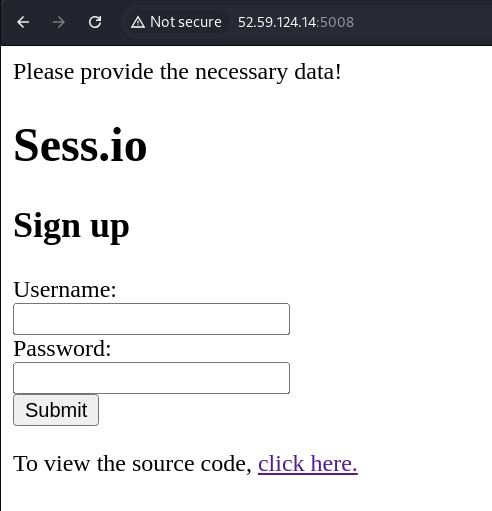

# Sess.io

*Long sessions must be secure, right?*

- *Autor do writeup: [@jackskelt](https://github.com/jackskelt)*
- *Autor do desafio: [@gehaxelt](https://github.com/gehaxelt)*

> Você pode acessar os arquivos do desafio no nosso repositório
> <https://github.com/HawkSecUnifei/Writeups>


Ao fazer login, nos deparamos com uma tela de login. Temos a opção de pegar o código fonte da página.





```php
<?php
define("ALPHA", str_split("abcdefghijklmnopqrstuvwxyz0123456789_-"));
ini_set("error_reporting", 0);

if(isset($_GET['source'])) {
    highlight_file(__FILE__);
}

include "flag.php"; // $FLAG
$SEEDS = str_split($FLAG, 4);

function session_id_secure($id) {
    global $SEEDS;
    mt_srand(intval(bin2hex($SEEDS[md5($id)[0] % (count($SEEDS))]),16));
    $id = "";
    for($i=0;$i<1000;$i++) {
        $id .= ALPHA[mt_rand(0,count(ALPHA)-1)];
    }
    return $id;
}

if(isset($_POST['username']) && isset($_POST['password'])) {
    session_id(session_id_secure($_POST['username'] . $_POST['password']));
    session_start();
    echo "Thank you for signing up!";
}else {
    echo "Please provide the necessary data!";
}
?>
```



Analisando o código, vemos que a flag é dividida em segmentos de 4 bytes. Temos também a função `session_id_secure()` que recebe o nome de usuário e senha concatenados. Vamos então analisar essa função



```php
function session_id_secure($id) {
    global $SEEDS;
    mt_srand(intval(bin2hex($SEEDS[md5($id)[0] % (count($SEEDS))]),16));
    $id = "";
    for($i=0;$i<1000;$i++) {
        $id .= ALPHA[mt_rand(0,count(ALPHA)-1)];
    }
    return $id;
}
```



Essa função utiliza `mt_rand()` para gerar números pseudoaleatórios, mas antes disso, inicializa a seed do gerador (`mt_srand()`) com um valor derivado de `$SEEDS`. Esse array contém os segmentos da flag e a posição utilizada é determinada pelo primeiro caractere do hash `md5($id)`, tomado como um número hexadecimal (`0-9A-F`) e reduzido ao intervalo válido pelo operador módulo (`% count($SEEDS)`).

Após definir a seed, a função gera um identificador de sessão composto por 1000 caracteres aleatórios escolhidos de ALPHA.

O problema é que `mt_srand()` torna a sequência gerada por `mt_rand()` completamente previsível. Com ferramentas como [`php_mt_seed`](https://github.com/openwall/php_mt_seed), podemos recuperar a seed utilizada a partir dos valores gerados.

Como o primeiro caractere do hash `md5` sempre será um hexadecimal (`0-9A-F`), há no máximo 16 possíveis índices dentro do array `$SEEDS`. Isso significa que, ao testar diferentes entradas (`username` e `password`), conseguimos inferir qual segmento da flag foi usado como seed e, consequentemente, extrair partes dela.

```bash
0:
  Input: 27
  MD5:   02e74f10e0327ad868d138f2b4fdd6f0

1:
  Input: 6
  MD5:   1679091c5a880faf6fb5e6087eb1b2dc

2:
  Input: 51
  MD5:   2838023a778dfaecdc212708f721b788

3:
  Input: 21
  MD5:   3c59dc048e8850243be8079a5c74d079

4:
  Input: 9
  MD5:   45c48cce2e2d7fbdea1afc51c7c6ad26

5:
  Input: 91
  MD5:   54229abfcfa5649e7003b83dd4755294

6:
  Input: 11
  MD5:   6512bd43d9caa6e02c990b0a82652dca

7:
  Input: 17
  MD5:   70efdf2ec9b086079795c442636b55fb

8:
  Input: 7
  MD5:   8f14e45fceea167a5a36dedd4bea2543

9:
  Input: 15
  MD5:   9bf31c7ff062936a96d3c8bd1f8f2ff3

a:
  Input: 4
  MD5:   a87ff679a2f3e71d9181a67b7542122c

b:
  Input: 22
  MD5:   b6d767d2f8ed5d21a44b0e5886680cb9

c:
  Input: 0
  MD5:   cfcd208495d565ef66e7dff9f98764da

d:
  Input: 10
  MD5:   d3d9446802a44259755d38e6d163e820

e:
  Input: 3
  MD5:   eccbc87e4b5ce2fe28308fd9f2a7baf3

f:
  Input: 44
  MD5:   f7177163c833dff4b38fc8d2872f1ec6
```

Podemos agora fazer um script python para explorar de forma automática e achar a flag



```py
from multiprocessing.pool import Pool
import subprocess
import httpx
import re

# URL do alvo
url = 'http://52.59.124.14:5008'

# Mapeamento de inputs para seus respectivos índices hexadecimais
get_index = {
    "0": 27,  # MD5: 02e74f10e0327ad868d138f2b4fdd6f0
    "1": 6,   # MD5: 1679091c5a880faf6fb5e6087eb1b2dc
    "2": 51,  # MD5: 2838023a778dfaecdc212708f721b788
    "3": 21,  # MD5: 3c59dc048e8850243be8079a5c74d079
    "4": 9,   # MD5: 45c48cce2e2d7fbdea1afc51c7c6ad26
    "5": 91,  # MD5: 54229abfcfa5649e7003b83dd4755294
    "6": 11,  # MD5: 6512bd43d9caa6e02c990b0a82652dca
    "7": 17,  # MD5: 70efdf2ec9b086079795c442636b55fb
    "8": 7,   # MD5: 8f14e45fceea167a5a36dedd4bea2543
    "9": 15,  # MD5: 9bf31c7ff062936a96d3c8bd1f8f2ff3
    "a": 4,   # MD5: a87ff679a2f3e71d9181a67b7542122c
    "b": 22,  # MD5: b6d767d2f8ed5d21a44b0e5886680cb9
    "c": 0,   # MD5: cfcd208495d565ef66e7dff9f98764da
    "d": 10,  # MD5: d3d9446802a44259755d38e6d163e820
    "e": 3,   # MD5: eccbc87e4b5ce2fe28308fd9f2a7baf3
    "f": 44,  # MD5: f7177163c833dff4b38fc8d2872f1ec6
}


# Conjunto de caracteres usados na geração do session_id
alpha = 'abcdefghijklmnopqrstuvwxyz0123456789_-'
count = len(alpha)

print('[*] Recuperando a seed do Mersenne Twister')

def brute_chunk(i):
    hex_index = hex(i)[2:]
    username = get_index[hex_index]

    # Obtendo o cookie PHPSESSID gerado
    cook = httpx.post(url, data={'username': username, 'password': ''}).cookies.get('PHPSESSID')
    idxs = [str(alpha.find(c)) for c in cook[:30]]

    # Chamando php_mt_seed para descobrir a seed original
    # Voce deve ter o binario no local onde esta chamando
    args = ['./php_mt_seed']
    for x in idxs:
        args.extend([x, x, "0", str(count-1)])

    p = subprocess.Popen(args, stdout=subprocess.PIPE, stderr=subprocess.DEVNULL)

    while True:
        line = p.stdout.readline()
        if line:
            if b'PHP 7.1.0+' in line:
                segment = re.search(r'seed = 0x(\w{8})', line.decode()).groups()[0]
                decoded = bytes.fromhex(segment).decode()
                print(f'[{hex_index}] {decoded}')
                return hex_index, decoded
        else:
            print(f'Erro ao processar {hex_index}')
            break

# Executa o brute force em paralelo
results = dict(Pool(4).map(brute_chunk, range(0xb)))

# Imprime a flag em ordem hexadecimal
flag = ''.join(results[key] for key in sorted(results))
print(f'\nFlag: {flag}')
```




O código pode demorar bastante para rodar dependendo do seu hardware.


```bash
$ python exploit.py
[*] Recuperando a seed do Mersenne Twister
[0] ENO{
[2] _SUP
[3] ER_S
[1] SOME
[4] ECUR
[6] AG_1
[7] 3333
[5] E_FL
[8] 37_H
[9] ACK}

Flag: ENO{SOME_SUPER_SECURE_FLAG_1333337_HACK}
```