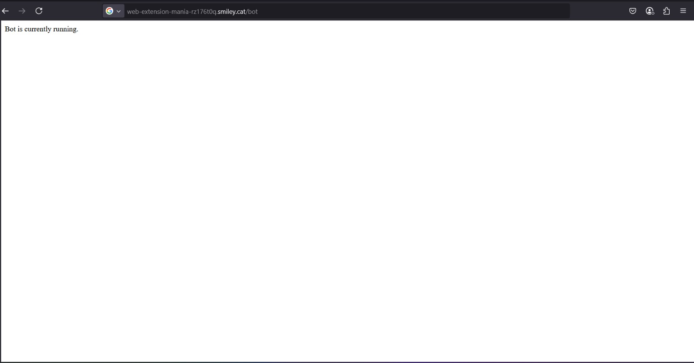
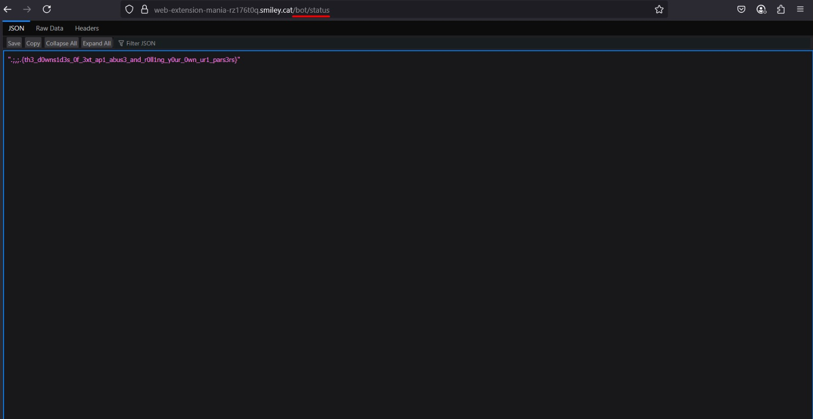

# 🧩 Extension Mania — smileyCTF 2025

- **Categoria:** Web
- **Autor:** smashmaster
- **Writeup por:** [João Vitor](https://github.com/jvittor1) e [Gabriel](https://github.com/gabrielhdsalves)

---

## 📜 Descrição

> _Can't stop doing tiny patched zero days as CTF challenges xd, you may find this one relatable._

Foi fornecido um servidor com funcionalidades controladas por duas extensões instaladas no navegador do bot.

As rotas disponíveis:

- `POST /update` — Atualiza o HTML da página principal que o bot visita.
- `POST /bot` — Faz o bot visitar a página atual.
- `GET /bot/status` — Mostra o status atual do bot e, se possível, a flag.

---

## 🔍 Análise

Ao baixar o código fornecido no site do CTF, observamos que a flag só será exibida se a variável `shouldGiveFlag` for `true`.

```javascript
if (
  currentUrl.host === config.host ||
  currentUrl.host === `${config.host}:${config.port}`
) {
  shouldGiveFlag = true;
}
```

Ou seja:  
✅ **A flag só aparece se a última URL acessada pelo bot for no mesmo domínio que o da aplicação (`coolctfgames.localhost`)**

---

## 🛠️ Vulnerabilidade explorada

O desafio envolvia **XSS do tipo Stored** (armazenado):  
A rota `/update` nos permitia injetar HTML e JavaScript persistente, que seria executado quando o bot acessasse a página via `/bot`.

A partir disso, a estratégia foi explorar esse XSS para fazer com que o bot, ao visitar nossa página, **também acessasse a URL protegida**, que estava no mesmo domínio, ativando `shouldGiveFlag`.

---

## 🚀 Estratégia

1. Copiamos o conteúdo da página protegida (`http://coolctfgames.localhost:3000/`).

   > Embora não pudéssemos acessá-la diretamente, era possível copiar o conteúdo (não havia restrição para isso).

2. Injetamos o conteúdo copiado dentro de um `<iframe>` usando JavaScript.

3. Como nosso HTML foi armazenado e seria renderizado pelo bot, o código JavaScript seria executado automaticamente:  
   ✅ Um **XSS Stored executado pelo bot**.

4. Isso forçava o bot a visitar novamente o mesmo domínio (`coolctfgames.localhost`), ativando a flag.

---

## 💥 Código injetado

Esse foi o payload JavaScript enviado via `POST /update`:

```html
<script>
  const iframe = document.createElement("iframe");
  iframe.src = "http://coolctfgames.localhost:3000/";
  document.body.appendChild(iframe);
</script>
```

#### 🖼️ Resultado da injeção:



Após injetar o código, foi necessário executar o bot visitando diretamente a URL `http://coolctfgames.localhost:3000` através da rota `/bot`.

#### 🖼️ Execução do bot com iframe carregado:


Depois de esperar alguns segundos para que o script fosse executado e o estado atualizado, a flag foi liberada com sucesso.

---

## Obtenção da Flag

Após o bot visitar a página com o código injetado, acessamos a rota `/bot/status`. Como a variável `shouldGiveFlag` agora estava `true`, a flag foi revelada:

#### 🖼️ Flag revelada:



```json
{
  "flag": ".;,;.{th3_d0wns1d3s_0f_3xt_ap1_abus3_and_r0ll1ng_y0ur_0wn_ur1_pars3rs}"
}
```

## ✅ Conclusão

Esse desafio explorou:

- O uso de **XSS Stored** para executar JavaScript no navegador do bot;
- A simulação de um acesso legítimo à URL protegida dentro do mesmo domínio;
- A restrição baseada no host da URL para liberar a flag.

Ao compreender a lógica de confiança do domínio e injetar dinamicamente a página original via iframe, foi possível contornar a proteção de forma elegante e obter a flag.
