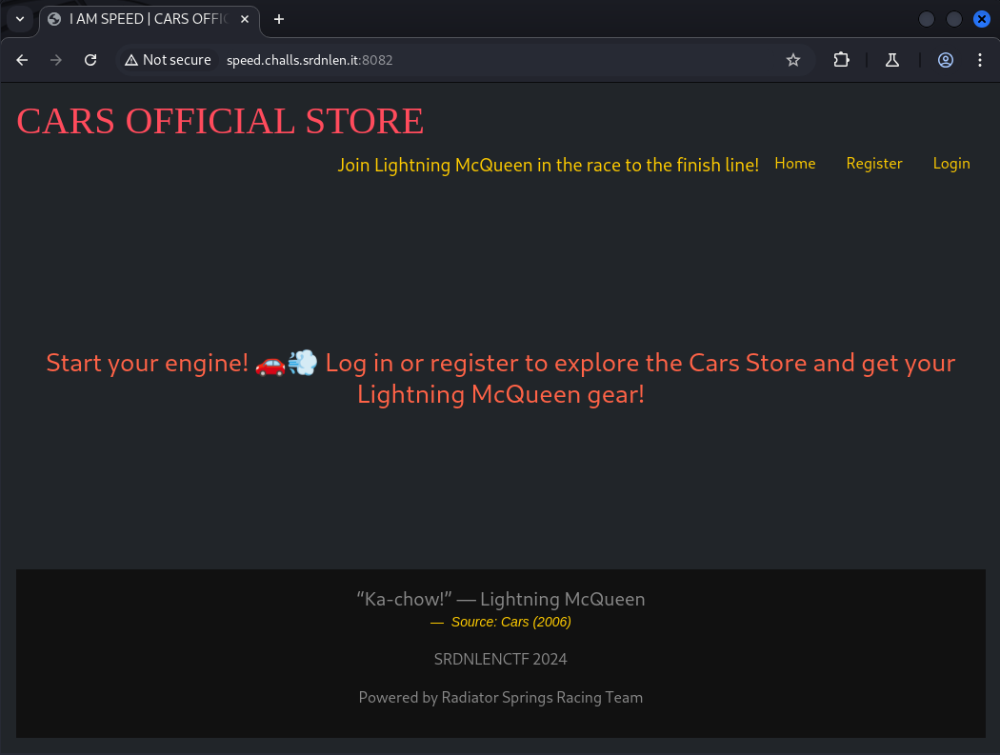
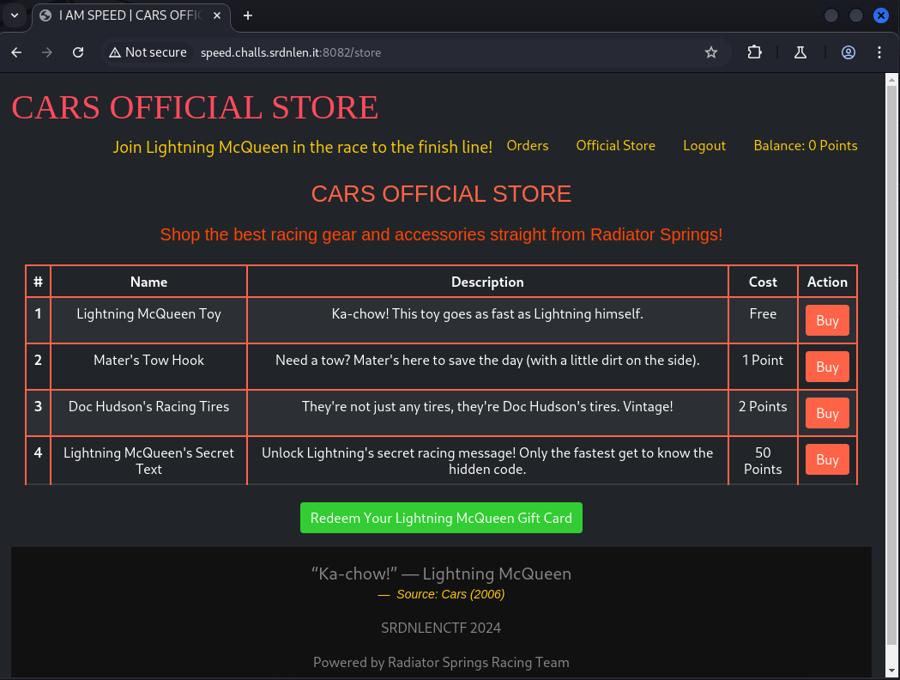
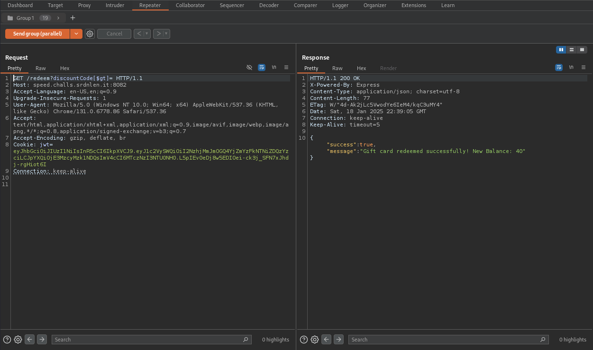
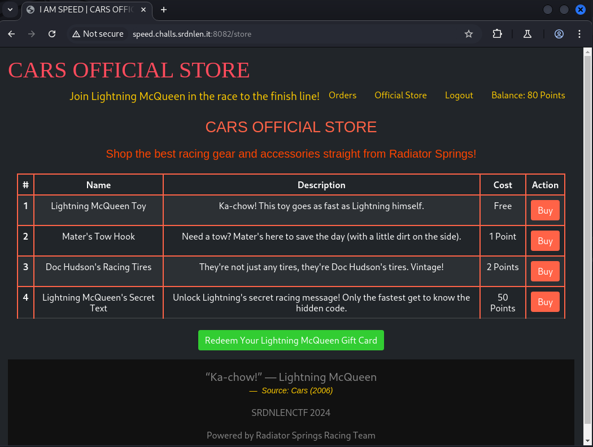
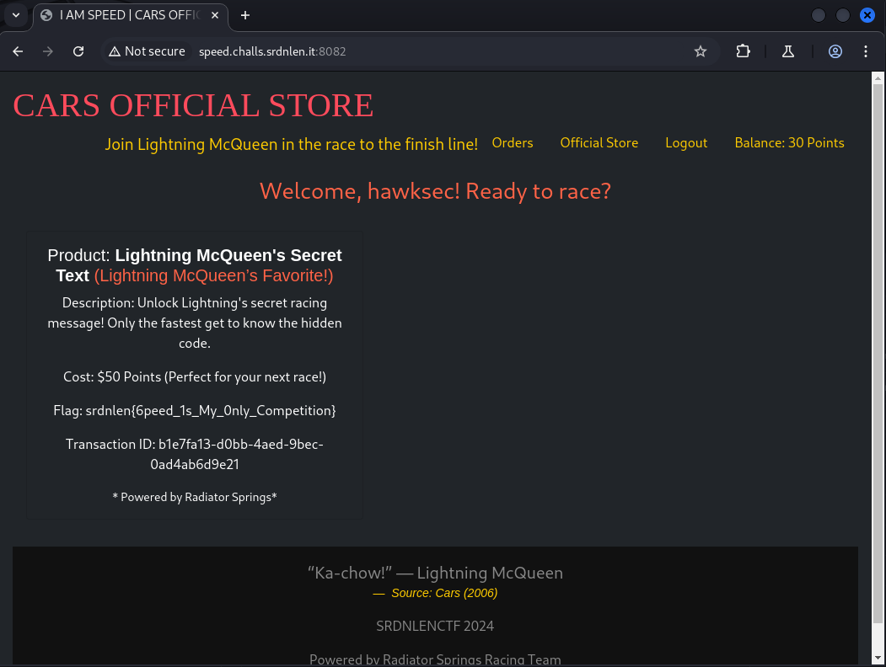

# Focus. Speed. I am speed.

*Welcome to Radiator Springs' finest store, where every car enthusiast's dream comes true! But remember, in the world of racing, precision matters—so tread carefully as you navigate this high-octane experience. Ka-chow!*

- *Autor do desafio: [@Octaviusss](https://github.com/Octaviusss)*
- *Autor do writeup: [@jackskelt](https://github.com/jackskelt)*

> Você pode acessar os arquivos do desafio no nosso repositório
> <https://github.com/HawkSecUnifei/Writeups>


O desafio consiste em NoSQL Injection (MongoDB) e Racing Condition. Ao acessar o site, nos deparamos com a página inicial de uma loja de produtos do filme Carros. Podemos ver que temos autenticação, já que tem a presença de registro.




Analisando o código, encontramos essa parte do código que lista os produtos, e podemos perceber que a flag está presente na chave `FLAG` do produto de id 4 *"Lightning McQueen's Secret Text"* que custa 50 pontos.

```js
// server/app.js:67

const products = [
    { productId: 1, Name: "Lightning McQueen Toy", Description: "Ka-chow! This toy goes as fast as Lightning himself.", Cost: "Free" },
    { productId: 2, Name: "Mater's Tow Hook", Description: "Need a tow? Mater's here to save the day (with a little dirt on the side).", Cost: "1 Point" },
    { productId: 3, Name: "Doc Hudson's Racing Tires", Description: "They're not just any tires, they're Doc Hudson's tires. Vintage!", Cost: "2 Points" },
    { 
        productId: 4, 
        Name: "Lightning McQueen's Secret Text", 
        Description: "Unlock Lightning's secret racing message! Only the fastest get to know the hidden code.", 
        Cost: "50 Points", 
        FLAG: process.env.FLAG || 'SRDNLEN{fake_flag}' 
    }
];
```


Para ver a loja, é preciso fazer login. Assim que fazemos login, podemos acessar a "Official Store", onde estão listados os produtos. E nela podemos perceber que temos um botão para resgatar um Gift Card.




Observando um pouco mais o código, achamos essa função que faz a criação dos gift cards, porém é de forma aleatória, então vai ser muito difícil adivinhar.

```js
// server/app.js:22
// Generate a random discount code
const generateDiscountCode = () => {
    const characters = 'ABCDEFGHIJKLMNOPQRSTUVWXYZ0123456789';
    let discountCode = '';
    for (let i = 0; i < 12; i++) {
        discountCode += characters.charAt(Math.floor(Math.random() * characters.length));
    }
    return discountCode;
};

// server/app.js:91
// Insert randomly generated Discount Codes if they don't exist
const createDiscountCodes = async () => {
    const discountCodes = [
        { discountCode: generateDiscountCode(), value: 20 }
    ];

    for (const code of discountCodes) {
        const existingCode = await DiscountCodes.findOne({ discountCode: code.discountCode });
        if (!existingCode) {
            await DiscountCodes.create(code);
            console.log(`Inserted discount code: ${code.discountCode}`);
        } else {
            console.log(`Discount code ${code.discountCode} already exists.`);
        }
    }
};

// Call function to insert discount codes
await createDiscountCodes();
```

A rota de resgate dos gift cards tem coisas interessantes. O usuário só pode resgatar um giftcard por dia, e considerando o giftcard criado anteriormente, só poderiamos resgatar 20 pontos se soubessemos o código, mas precisamos de 50 pontos para comprar o produto que contem a flag.

```js
// server/routes:29
router.get('/redeem', isAuth, async (req, res) => {
    try {
        const user = await User.findById(req.user.userId);

        if (!user) {
            return res.render('error', { Authenticated: true, message: 'User not found' });
        }

        // Now handle the DiscountCode (Gift Card)
        let { discountCode } = req.query;
        
        if (!discountCode) {
            return res.render('error', { Authenticated: true, message: 'Discount code is required!' });
        }

        const discount = await DiscountCodes.findOne({discountCode})

        if (!discount) {
            return res.render('error', { Authenticated: true, message: 'Invalid discount code!' });
        }

        // Check if the voucher has already been redeemed today
        const today = new Date();
        const lastRedemption = user.lastVoucherRedemption;

        if (lastRedemption) {
            const isSameDay = lastRedemption.getFullYear() === today.getFullYear() &&
                              lastRedemption.getMonth() === today.getMonth() &&
                              lastRedemption.getDate() === today.getDate();
            if (isSameDay) {
                return res.json({success: false, message: 'You have already redeemed your gift card today!' });
            }
        }

        // Apply the gift card value to the user's balance
        const { Balance } = await User.findById(req.user.userId).select('Balance');
        user.Balance = Balance + discount.value;
        // Introduce a slight delay to ensure proper logging of the transaction 
        // and prevent potential database write collisions in high-load scenarios.
        new Promise(resolve => setTimeout(resolve, delay * 1000));
        user.lastVoucherRedemption = today;
        await user.save();

        return res.json({
            success: true,
            message: 'Gift card redeemed successfully! New Balance: ' + user.Balance // Send success message
        });

    } catch (error) {
        console.error('Error during gift card redemption:', error);
        return res.render('error', { Authenticated: true, message: 'Error redeeming gift card'});
    }
});
```

Um outro detalhe é em como o código que estamos enviando é processado. Ele é somente jogado em um objeto para fazer a query no Mongoose, sem qualquer sanitização. Logo, podemos explorar a vulnerabilidade de **NoSQL Injection**.

```js
// server/routes.js:44
const discount = await DiscountCodes.findOne({discountCode})
```

Só precisamos fazer a request `GET /redeem?discountCode[$gt]=`, que quando chegar na parte da query, seria traduzida no código abaixo. Explicando o que acontece: O `discountCode[$gt]=` na query será traduzido para um objeto contendo a chave `$gt` com um valor vazio. O [`$gt`](https://www.mongodb.com/docs/manual/reference/operator/query/gt/) é um operador de comparação do MongoDB que faz uma comparação de "maior que". Nesse caso, procura qualquer string maior do que uma string vazia, assim retornando um resultado válido no `findOne`.

```js
const discount = await DiscountCodes.findOne({
    discountCode: {
        $gt: "",
    }
})
```

Com isso conseguimos usar o código de desconto que nos dá 20 pontos, porém precisamos de 50. Voltando a analisar o código, tem um comentário, juntamente com uma parte do código, interessantes:

```js
        // Apply the gift card value to the user's balance
        const { Balance } = await User.findById(req.user.userId).select('Balance');
        user.Balance = Balance + discount.value;
        // Introduce a slight delay to ensure proper logging of the transaction 
        // and prevent potential database write collisions in high-load scenarios.
        new Promise(resolve => setTimeout(resolve, delay * 1000));
        user.lastVoucherRedemption = today;
        await user.save();
```

Esse código me parece vulnerável a race condition. Uma race condition ocorre quando dois ou mais processos ou threads tentam acessar e modificar um recurso compartilhado (nesse caso um banco de dados) ao mesmo tempo, e o resultado final depende da ordem de execução desses processos. Isso pode causar comportamentos imprevisíveis e erros, como dados incorretos ou inconsistentes.


Logo, se eu enviar várias requisições ao mesmo tempo para a mesma informação, pode ser que eu saia com mais saldo do que o que era pra ser computado.
<details>
<summary>Spoiler</summary>

O `new Promise` não tá fazendo nada ali já que não tem um await.
</details>

Então decidi utilizar o [`Burp Suite`](https://portswigger.net/burp) para fazer essas requisições (pode ser feito em código também).
Para isso, peguei uma request para resgate e mandei para o `Repeater`. Nisso, fiz um grupo de requisições e adicionei várias, mudei o modo de envio para `Send Group (parallel)`, para enviar todas as requisições ao mesmo tempo em paralelo e consegui adicionar mais saldo que esperado.



Recarreguei a página e agora estou com um saldo de 80 pontos, assim podendo comprar o produto que contém a flag e depois ir para a página de `Orders` buscar a flag



E finalmente obtendo a flag

```
srdnlen{6peed_1s_My_0nly_Competition}
```

