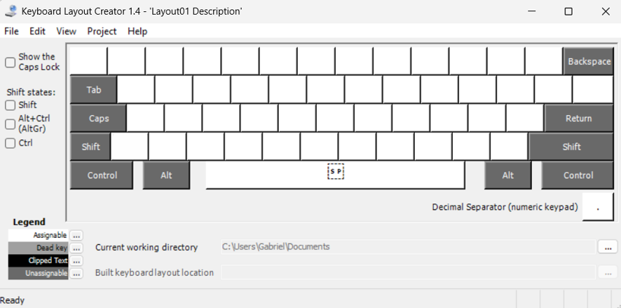
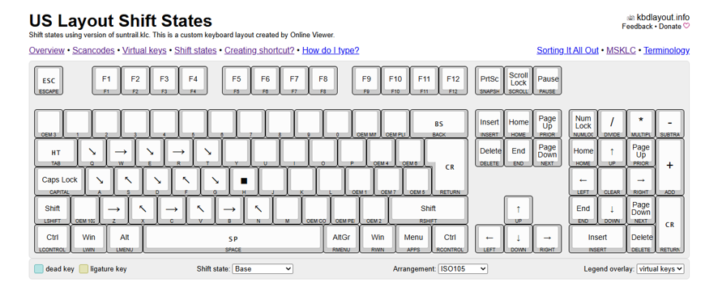
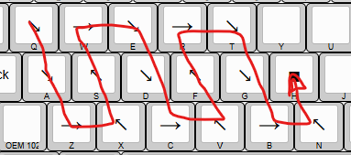
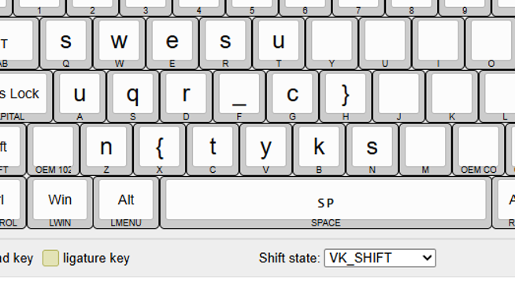

# WriteUp: suntrail
## Descrição do Desafio
**Categoria:** misc/forense \
**Descrição:**
> im lost, but you can find the way!

### Arquivos
| Arquivo | Descrição |
| ------- | --------- |
| suntrail.klc | Arquivo de layout de teclado customizado (Keyboard Layout Creator). |

> 📥 **Download:** [suntrail.klc](https://github.com/HawkSecUnifei/Writeups/raw/refs/heads/main/2026/SunshineCTF/suntrail/suntrail.klc)

> 💡 **Dica:** microsoft keyboard layout creator

## Passo a Passo da Solução
### 1. Análise do arquivo .klc
Um arquivo `.klc` serve para definir uma configuração personalizada das teclas no Windows: ele redefine o que cada tecla produz ao ser apertada e mapeia símbolos especiais para elas.

Abrindo o arquivo no bloco de notas:

```bash
KBD     kbdusx     "US"

SHIFTSTATE

0
1
2

LAYOUT

10   Q   0   2198   0073   -1
11   W   0   2192   0077   -1
12   E   0   2198   0065   -1
13   R   0   2192   0073   -1
14   T   0   2198   0075   -1

1e   A   0   2198   0075   -1
1f   S   0   2196   0071   -1
20   D   0   2198   0072   -1
21   F   0   2196   005f   -1
22   G   0   2198   0063   -1
23   H   0   25a0   007d   -1

2c   Z   0   2192   006e   -1
2d   X   0   2196   007b   -1
2e   C   0   2192   0074   -1
2f   V   0   2196   0079   -1
30   B   0   2192   006b   -1
31   N   0   2196   0073   -1

39   SPACE   0   0020   0020   -1

ENDKBD
```

O `SHIFTSTATE` define os estados de modificação das teclas: `0` (normal), `1` (com SHIFT) e `2` (com CTRL). Para a primeira tecla definida, `10 Q 0 2198 0073 -1`:

- `10` — scancode (código hexadecimal da tecla física)
- `Q` — key name (nome de referência)
- `0` — capstype (comportamento padrão com Caps Lock)
- `2198` — caractere gerado ao pressionar normalmente
- `0073` — caractere gerado com SHIFT
- `-1` — CTRL não gera caractere

Ou seja, ao apertar normalmente a letra **Q** o layout gera o caractere **↘** (U+2198), e ao apertar com **Shift**, gera **s** (U+0073).

### 2. Visualizando o layout
A dica do desafio sugere o software **Microsoft Keyboard Layout Creator (MSKLC)**. 



Porém, ao tentar carregar o `suntrail.klc` no aplicativo, ocorre o erro:

Para contornar isso, foi usada uma alternativa online:

🔗 **https://kbdlayout.info/viewer**

Carregando o arquivo no site, é possível visualizar corretamente o layout completo, tanto no estado normal quanto com SHIFT pressionado.



### 3. Encontrando o caminho
Relembrando a string do desafio — *"im lost, but you can find the way!"* — percebe-se que, no layout **normal**, os caracteres gerados não são letras, e sim símbolos de seta (↘, →, ↗, ↖ etc.). Ao iniciar pela tecla **Q**, essas setas desenham um **caminho** visual sobre o teclado, passando por: Q → W → E → R → T → A → S → D → F → G → H → N → B → V → C → X → Z...



Em seguida, analisando o layout com **SHIFT** pressionado, cada tecla passa a gerar outro caractere (letras, `_`, `{`, `}` etc.), formando uma nova disposição de teclado.



Aplicando a sequência de teclas descoberta pelo caminho de setas sobre esse novo layout (com SHIFT), constrói-se a flag caractere por caractere.

### Flag
`sun{qwerty_sucks}`

## Autor da WriteUp
[GabrielFColombo](https://github.com/GabrielFColombo)