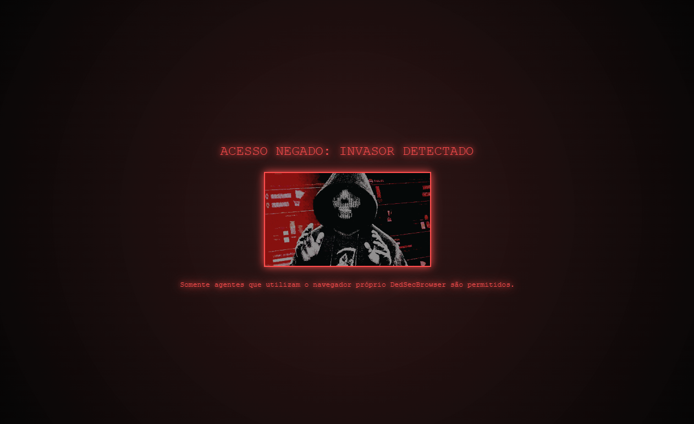
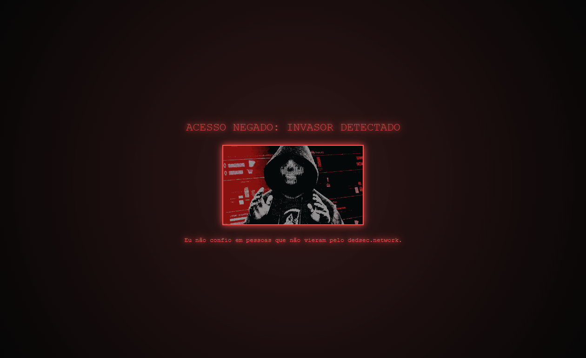
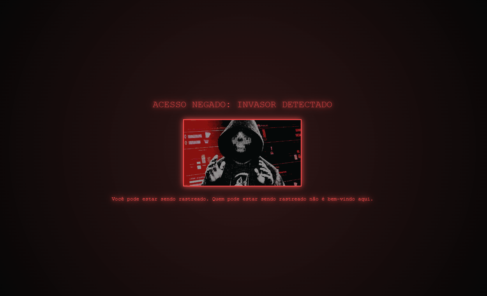
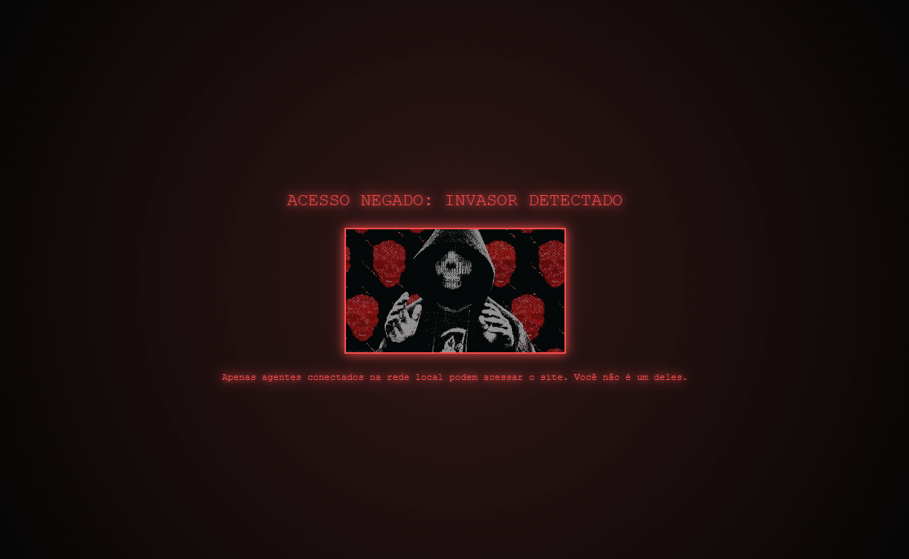
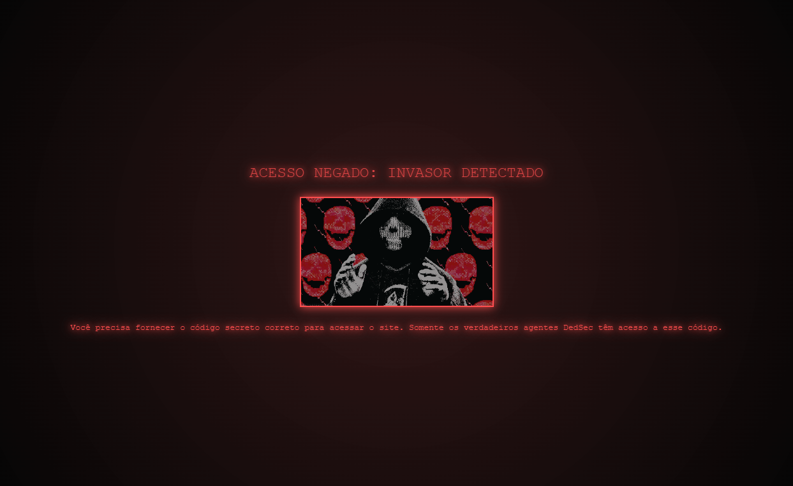
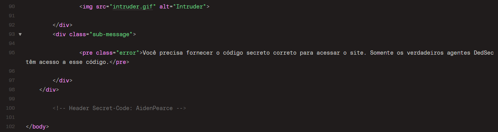
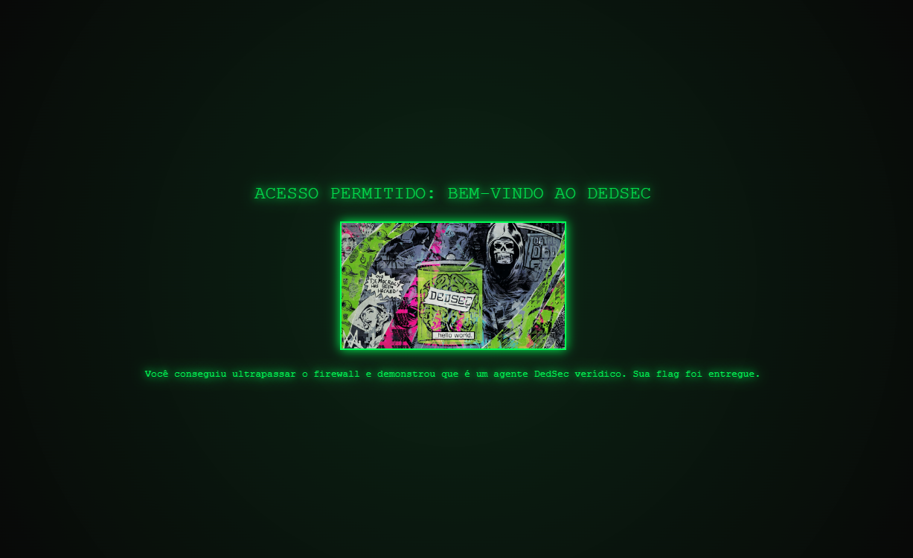
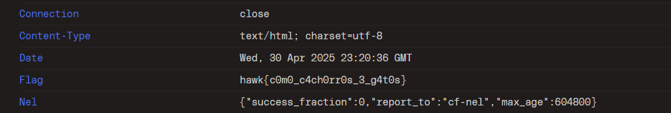

# Assistindo Cachorros

> Você foi recrutado como o mais novo membro do DedSec. Eles te passaram o site da organização, porém não te contaram como acessar. Agora você terá que usar das pistas para conseguir o acesso.
>
> *"Duas cabeças pensam melhor que uma, mas a outra tem que ter o seu próprio cérebro!"*

- **Autor:** [@jackskelt](https://github.com/jackskelt)
- *O desafio foi inspirado no desafio [Who Are You?](https://play.picoctf.org/practice/challenge/142) do [PicoCTF](https://picoctf.org/)*


Ao entrar no site, somos recebidos com uma tela dizendo "Acesso Negado: Invasor Detectado" e a descrição "Somente agentes que utilizam o navegador próprio DedSecBrowser são permitidos."

<details>
<summary>Dica na Descrição</summary>

Analisando a descrição do desafio, temos a frase "Duas cabeças pensam melhor que uma, mas a outra tem que ter o seu próprio cérebro!". Isso dá a dica de que temos que utilizar os [headers](https://developer.mozilla.org/pt-BR/docs/Web/HTTP/Reference/Headers) (*head*, do inglês, cabeça) para resolver o desafio.

</details>



O site consegue saber o navegador que estamos utilizando pelo header [`User-Agent`](https://developer.mozilla.org/pt-BR/docs/Web/HTTP/Reference/Headers/User-Agent), que é enviado em todas as requisições HTTP. Então podemos modificar esse header para `DeadSecBrowser`.


```bash
curl -H "User-Agent: DeadSecBrowser" URL
```




Assim agora temos outra mensagem: "Eu não confio em pessoas que não vieram pelo dedsec.network". O site agora está pedindo para que utilizemos o [`Referer`](https://developer.mozilla.org/pt-BR/docs/Web/HTTP/Reference/Headers/Referer) (referência) para conseguir acessar o site. O header [`Referer`](https://developer.mozilla.org/pt-BR/docs/Web/HTTP/Reference/Headers/Referer) é utilizado para informar de onde o usuário veio, ou seja, qual página ele estava antes de acessar a página atual. Então vamos adicionar esse header também.


```bash
curl -H "User-Agent: DeadSecBrowser" \
    -H "Referer: dedsec.network" URL
```




Obtemos mais uma mensagem: "Você pode estar sendo rastreado. Quem pode estar sendo rastreado não é bem-vindo aqui.". Agora o site está pedindo para que utilizemos o [`DNT`](https://developer.mozilla.org/pt-BR/docs/Web/HTTP/Reference/Headers/DNT) (Do Not Track). O header [`DNT`](https://developer.mozilla.org/pt-BR/docs/Web/HTTP/Reference/Headers/DNT) é utilizado para informar se o usuário deseja ou não ser rastreado. Então vamos adicionar esse header também.


```bash
curl -H "User-Agent: DeadSecBrowser" \
    -H "Referer: dedsec.network" \
    -H "DNT: 1" URL
```




A mensagem agora é: "Apenas agentes conectados na rede local podem acessar o site. Você não é um deles.". Agora o site está pedindo para que utilizemos o [`X-Forwarded-For`](https://developer.mozilla.org/pt-BR/docs/Web/HTTP/Reference/Headers/X-Forwarded-For). O header [`X-Forwarded-For`](https://developer.mozilla.org/pt-BR/docs/Web/HTTP/Reference/Headers/X-Forwarded-For) é utilizado para informar o endereço IP do cliente que está fazendo a requisição. Então vamos adicionar esse header como `127.0.0.1` ou `localhost`.


```bash
curl -H "User-Agent: DeadSecBrowser" \
    -H "Referer: dedsec.network" \
    -H "DNT: 1" \
    -H "X-Forwarded-For: 127.0.0.1" URL
```




O site está pedindo um código secreto. Analisando o código fonte do site, achamos um comentário com o texto `<!-- Header Secret-Code: AidenPearce -->`. Esse é o código secreto que precisamos fornecer para acessar o site. Vamos adicionar esse header também.


```bash
curl -H "User-Agent: DeadSecBrowser" \
    -H "Referer: dedsec.network" \
    -H "DNT: 1" \
    -H "X-Forwarded-For: 127.0.0.1" \
    -H "Secret-Code: AidenPearce" URL
```






O site diz que a flag foi entregue, porém ela não está visível. Analisando os headers da resposta, vemos que o header `Flag` foi adicionado com o valor `hawk{c0m0_c4ch0rr0s_3_g4t0s}`.



```bash
Flag: hawk{c0m0_c4ch0rr0s_3_g4t0s}
```