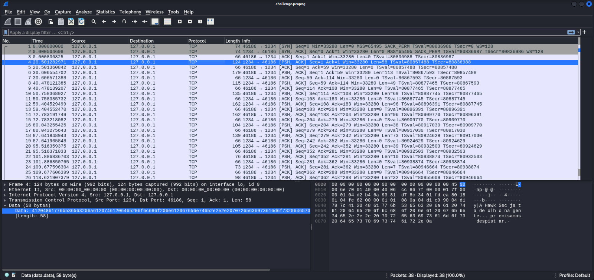
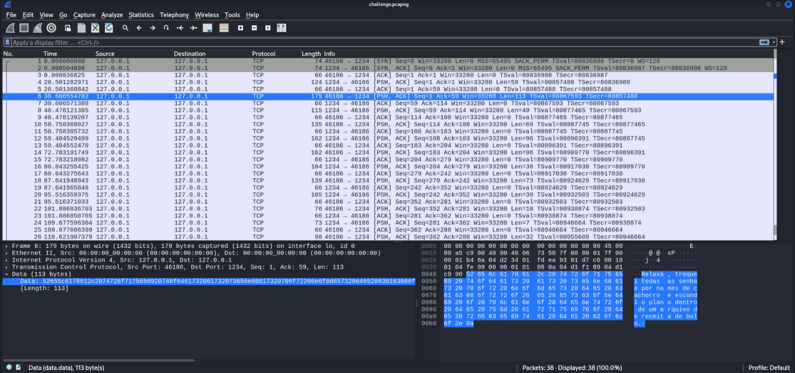
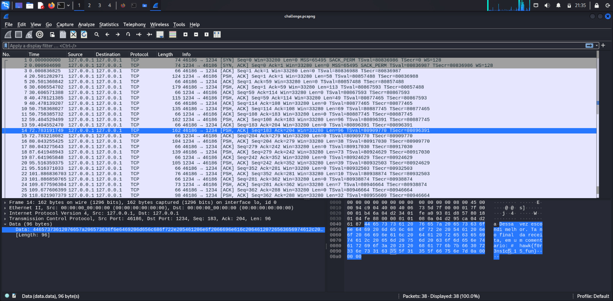
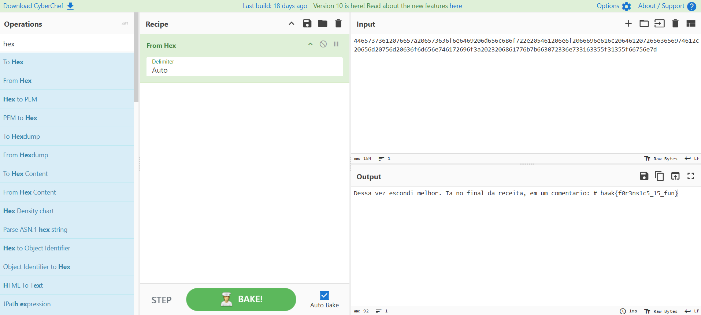

# Era só um bate-papo (só que não)

> Agentes da HawkSec interceptaram uma troca de mensagens suspeita entre dois indivíduos que achavam estar sendo muito discretos... mas esqueceram de um detalhe: nada escapa ao olhar atento de um bom analista forense!
Durante a conversa, deixaram escapar algo importante — uma pista valiosa que poderia comprometer toda a operação. Agora, cabe a você descobrir o que foi revelado sem querer. Entre as linhas e entre os pacotes, a verdade pode estar escondida onde menos se espera.

> 📥 **Download:** [Arquivo](https://github.com/HawkSecUnifei/dinamica-2025/raw/refs/heads/main/era_so_um_bate_papo_sqn/challenge.pcapng)

- **Autora:** [@Ana Luiza Oliveira](https://github.com/Ana-Luiza-Oliveira)

Foi fornecido um arquivo `challenge.pcapng`, que é um formato utilizado para armazenar capturas de pacotes de rede. Ao analisar utilizando o Wireshark, percebemos que se trata de uma comunicação usando o protocolo TCP:

Analisando a sequência de pacotes, chegamos em uma mensagem com a flag esperada:

Porém, para pegá-la corretamente, podemos descriptografar a sequência de caracteres vista ao lado inferior esquerdo: `44657373612076657a206573636f6e6469206d656c686f722e205461206e6f2066696e616c20646120726563656974612c20656d20756d20636f6d656e746172696f3a2023206861776b7b663072336e733163355f31355f66756e7d`

Podemos decodificar esse texto em hex usando o [CyberChef](https://gchq.github.io/CyberChef/):

Flag: `hawk{f0r3ns1c5_15_fun}`