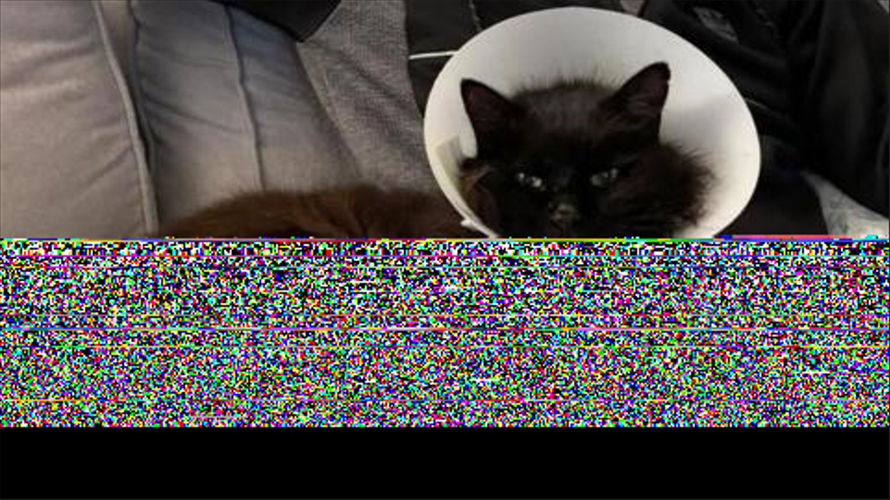
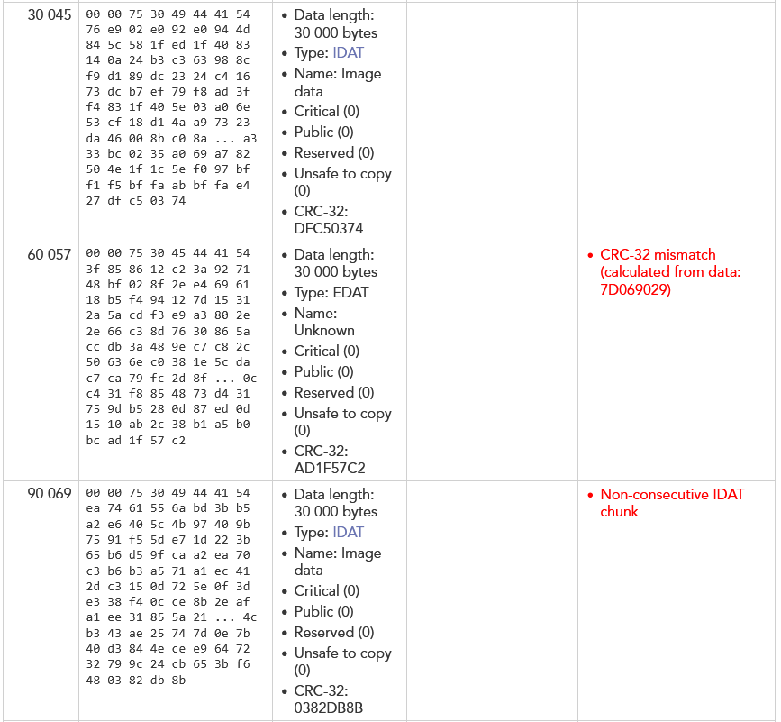
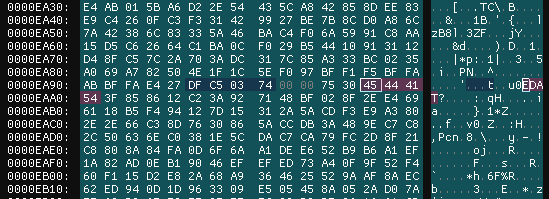
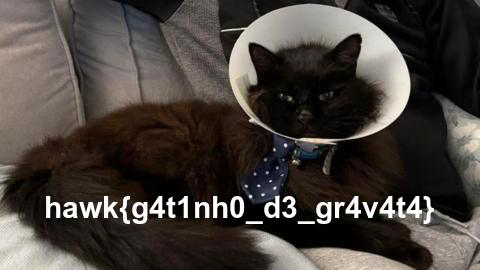

# Gato em Pedaços

> Um amigo me mandou a foto do gato dele, porém não estou conseguindo ver ela inteira. Você pode me ajudar a arrumar?

- **Autor:** [@jackskelt](https://github.com/jackskelt)
- *O desafio foi inspirado no **Chunked Integrity** do **DawgCTF 2025***.

Baixando o arquivo `miau.png`, podemos perceber que metade da imagem está faltando, no caso, corrompida.

Podemos usar uma ferramenta para checar a integridade da imagem, como o [PNG file chunk inspector](https://www.nayuki.io/page/png-file-chunk-inspector). Ao abrir a imagem no site, podemos perceber que há alguns erros a partir do offset `60057`.

Analisando a especificação do formato PNG, podemos perceber que a imagem é composta por chunks, que são partes da imagem, que podem ser dados de controle, metadados ou dados da imagem. Cada chunk tem 3 partes primárias: tamanho, tipo e CRC (checksum), e outros dados dependendo do tipo de chunk.

A imagem pode ter os seguintes tipos de chunks principais:
- **IHDR**: contém informações sobre a imagem, como largura, altura, profundidade de cor, etc.
- **IDAT**: contém os dados da imagem.
- **IEND**: indica o final do arquivo PNG.

A partir do erro, podemos perceber um chunk do tipo **EDAT**, que não existe no formato PNG. Podemos tentar corrigir isso, mudando o tipo do chunk de **EDAT** para **IDAT**. Para isso, podemos usar um editor hexadecimal, como o [ImHex](https://github.com/WerWolv/ImHex).

Navegamos até o offset 60057 e mudamos o tipo do chunk de **EDAT** para **IDAT**. O chunk tem 4 bytes, então devemos mudar os bytes de `0x45 0x44 0x41 0x54` para `0x49 0x44 0x41 0x54`.

Assim, conseguimos corrigir a imagem. Agora, podemos abrir a imagem normalmente e obter a flag.

`hawk{g4t1nh0_d3_gr4v4t4}`

