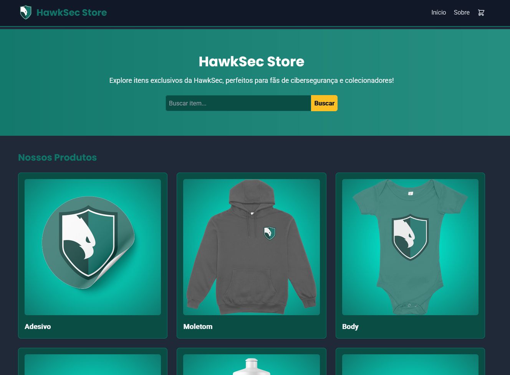
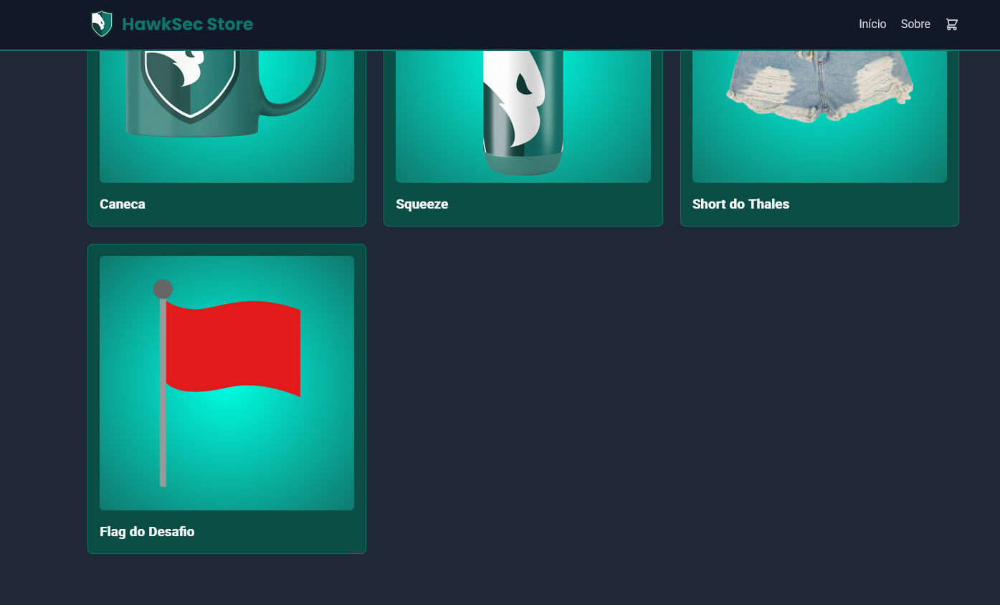
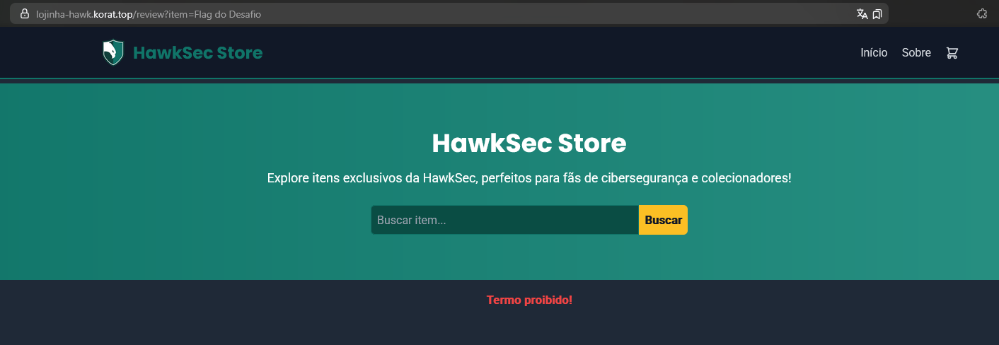
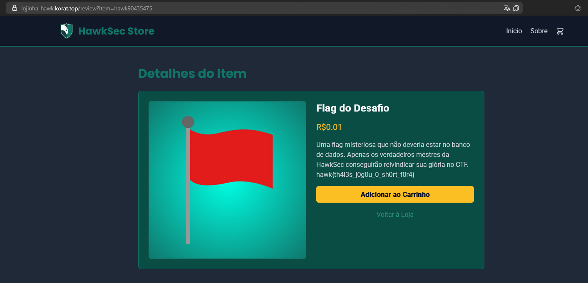

# Lojinha da HawkSec

> A HawkSec resolveu entrar no ramo do varejo e abriu a Lojinha da HawkSec, cheia de swags exclusivos pra quem curte um estilo hacker. De brinde, jogamos a flag desse desafio no catálogo. Mas não se engane: não é só clicar e comprar. A loja tem seus truques, e só os mais espertos vão conseguir colocar a flag no carrinho. Seu dinheiro chega lá? Ou vai precisar de algo a mais pra levar esse item pra casa?

- **Autor:** [@jackskelt](https://github.com/jackskelt)
- *O desafio foi inspirado no **Shopping Time** do **TUCTF24**. Temos writeup [aqui](../../../2025/TUCTF%2024/shopping-time/flag.png)*


Ao acessar o site, vemos que é uma loja online da HawkSec, onde podemos buscar por produtos.



Entretanto, temos o produto "Flag do Desafio", que ao ser acessado, recebemos o erro de `Termo Proibido`. O site acessa a rota `/review?item=Flag do Desafio`.





Analisando o código provido no desafio, temos o arquivo `server.js`:


```js
const express = require('express');
const sqlite3 = require('sqlite3').verbose();
const md5 = require('md5');
const path = require('path');
const { promisify } = require('util');

const PORT = process.env.PORT || 8000;
const DB_PATH = process.env.DB_PATH || 'shopping.db';
const BLOCKLIST = ['Flag do Desafio'];

const app = express();

app.set('view engine', 'ejs');
app.set('views', path.join(__dirname, 'views'));

app.set('public', __dirname + '/public');
app.use(express.static('public'));

app.use(express.urlencoded({ extended: true }));

const db = new sqlite3.Database(DB_PATH, (err) => {
    if (err) {
        console.error('Failed to connect to database:', err);
        process.exit(1);
    }
    console.log('Connected to SQLite database:', DB_PATH);
});

const dbGet = promisify(db.get.bind(db));
const dbAll = promisify(db.all.bind(db));

const handleDbError = (res, err, message) => {
    console.error(message, err);
    db.close((closeErr) => {
        if (closeErr) console.error('Error closing database:', closeErr);
    });
    return res.render('index', { items: [], error: message });
};

app.get('/', async (req, res) => {
    try {
        const items = await dbAll('SELECT name, image FROM items');
        res.render('index', { items, error: null });
    } catch (err) {
        console.error('Error fetching items:', err);
        res.render('index', { items: [], error: 'Erro ao carregar itens.' });
    }
});

app.get('/review', async (req, res) => {
    const item = req.query.item?.toString().trim();

    if (!item) {
        const items = await dbAll('SELECT name, image FROM items');
        return res.render('index', { items, error: 'Nenhum item fornecido.' });
    }

    if (BLOCKLIST.includes(item)) {
        const items = await dbAll('SELECT name, image FROM items');
        return res.render('index', { items, error: 'Termo proibido!' });
    }

    try {
        const row = await dbGet('SELECT * FROM items WHERE id = ?', [md5(item).slice(0, 6)]);

        if (!row) {
            const items = await dbAll('SELECT name, image FROM items');
            return res.render('index', { items, error: 'Item não encontrado!' });
        }

        res.render('review', {
            name: row.name,
            price: row.price,
            description: row.description,
            image: row.image,
        });
    } catch (err) {
        return handleDbError(res, err, 'Erro ao consultar o banco de dados.');
    }
});

// Gracefully handle shutdown
process.on('SIGTERM', () => {
    console.log('Shutting down...');
    db.close((err) => {
        if (err) console.error('Error closing database:', err);
        process.exit(0);
    });
});

app.listen(PORT, '0.0.0.0', () => {
    console.log(`Server running on http://0.0.0.0:${PORT}`);
});
```


Analisando o código, achamos algumas informações importantes:
- A variável `BLOCKLIST` contém os itens que não podem ser acessados. No caso, o item "Flag do Desafio" está nessa lista.
  

```js
const BLOCKLIST = ['Flag do Desafio'];
```


- Caso o item esteja na `BLOCKLIST`, a rota retorna o erro `Termo Proibido`.


```js
if (BLOCKLIST.includes(item)) {
    const items = await dbAll('SELECT name, image FROM items');
    return res.render('index', { items, error: 'Termo proibido!' });
}
```


- A rota `/review` é responsável por mostrar os detalhes do produto. Ela utiliza o `md5` do nome do item como id para buscar no banco de dados. O `md5` é cortado para os 6 primeiros caracteres, e esse valor é utilizado para buscar o item no banco de dados.
- Caso o item seja encontrado, a rota retorna os detalhes do produto, como nome, preço, descrição e imagem.


```js
app.get('/review', async (req, res) => {
    const item = req.query.item?.toString().trim();

    if (!item) {
        const items = await dbAll('SELECT name, image FROM items');
        return res.render('index', { items, error: 'Nenhum item fornecido.' });
    }

    if (BLOCKLIST.includes(item)) {
        const items = await dbAll('SELECT name, image FROM items');
        return res.render('index', { items, error: 'Termo proibido!' });
    }

    try {
        const row = await dbGet('SELECT * FROM items WHERE id = ?', [md5(item).slice(0, 6)]);

        if (!row) {
            const items = await dbAll('SELECT name, image FROM items');
            return res.render('index', { items, error: 'Item não encontrado!' });
        }

        res.render('review', {
            name: row.name,
            price: row.price,
            description: row.description,
            image: row.image,
        });
    } catch (err) {
        return handleDbError(res, err, 'Erro ao consultar o banco de dados.');
    }
});
```


O `md5` é uma função de hash, que transforma uma string em um valor fixo de 32 caracteres. Porém o servidor só utiliza os 6 primeiros caracteres do hash. Isso significa que existem várias strings diferentes que podem gerar o mesmo hash. Esse tipo de ataque é conhecido como [**collision attack**](https://en.wikipedia.org/wiki/Collision_attack).

Então por mais que o item "Flag do Desafio" esteja na `BLOCKLIST`, podemos ter uma string que gere os mesmos 6 primeiros caracteres do hash. Para isso, podemos utilizar o código:


```python
import hashlib

def find_collision(target):
    target_hash = hashlib.md5(target.encode()).hexdigest()
    target_prefix = target_hash[:6]
    print(f"Prefixo alvo: {target_prefix}")

    i = 0
    while True:
        candidate = f"hawk{i}"
        hash_value = hashlib.md5(candidate.encode()).hexdigest()
        if hash_value.startswith(target_prefix):
            print(f"Colisão Encontrada: Entrada = {candidate}, Hash = {hash_value}")
            return
        i += 1

find_collision("Flag do Desafio")
```


Rodando o código, encontramos a colisão:

```bash
$ python3 collision.py
Prefixo alvo: 15f95c
Colisão Encontrada: Entrada = hawk90435475, Hash = 15f95cd62c8cfadff0bc8d44c005c1ad
```



Você não precisa fazer a string começar com `hawk` e nem ser incremental. Basta apenas gerar uma string que tenha o mesmo hash. O código acima é apenas um exemplo de como fazer isso.


Com isso, conseguimos acessar a rota `/review?item=hawk90435475`, e conseguimos ver os detalhes do produto, onde a flag está localizada.

`hawk{th4l3s_j0g0u_0_sh0rt_f0r4}`

