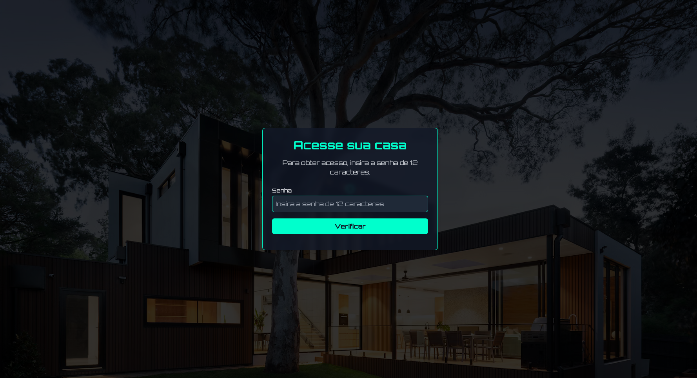
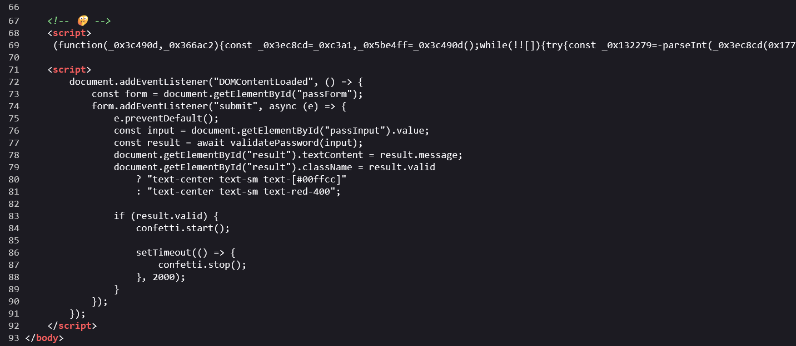
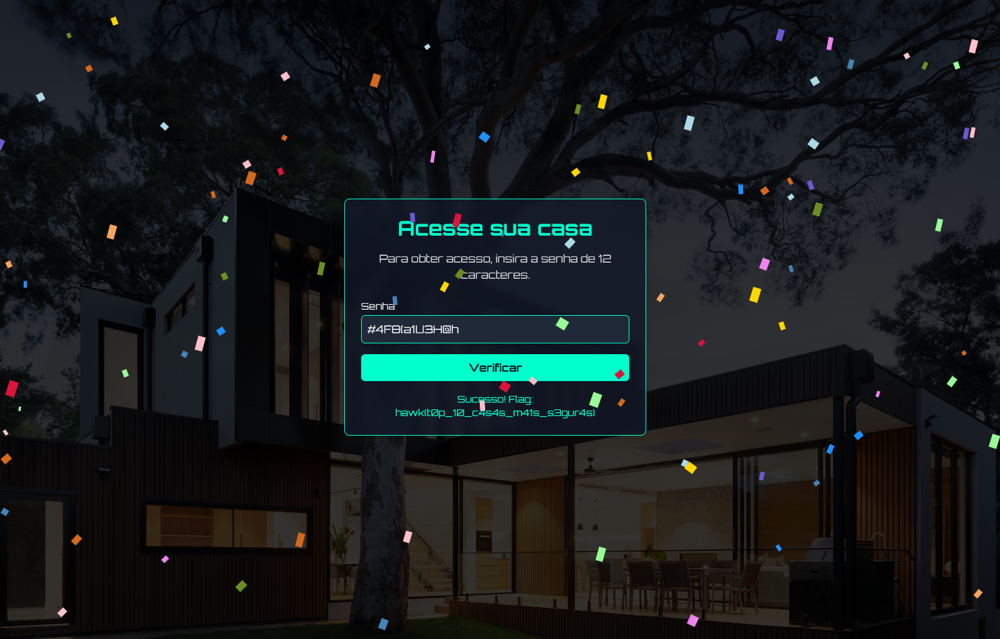

# Minha Casa Minha Vida

> Fui tentar acessar o sistema da minha casa, porém não me lembro da senha. Você pode inspecionar para mim?

- **Autor:** [@jackskelt](https://github.com/jackskelt)

Ao acessar o site, podemos ver que ele possui um campo de senha, onde diz que a senha deve conter 12 caracteres.



Podemos inspecionar o código fonte da página. Podemos perceber que quando o usuário clica para verificar a senha, o site chama uma função chamada `validatePassword()`, e também há um script ofuscado que parece ser o responsável por validar a senha.



Deobfuscando o código com [deobfuscate.io](https://obf-io.deobfuscate.io/), achamos a função `validatePassword()`.


```js
async function validatePassword(_0xe2e430) {
  if (_0xe2e430.length !== 0xc) {
    return {
      "valid": false,
      "message": "A senha deve ter 12 caracteres"
    };
  }
  const _0x1153fc = [_0xe2e430.slice(0x0, 0x3), _0xe2e430.slice(0x3, 0x6), _0xe2e430.slice(0x6, 0x9), _0xe2e430.slice(0x9, 0xc)];
  const _0x7efd4d = _0x1153fc[0x0].split('').reverse().join('') + _0x1153fc[0x1].split('').map(_0x296fca => String.fromCharCode(_0x296fca.charCodeAt(0x0) + 0x2)).join('') + btoa(_0x1153fc[0x2]) + _0x1153fc[0x3].split('').map((_0x598616, _0x490a47) => String.fromCharCode(_0x598616.charCodeAt(0x0) + _0x490a47 + 0x1)).join('');
  if (_0x7efd4d == "F4#:}cMVUzIBk") {
    try {
      const _0x354197 = await fetch("/flag?password=" + encodeURIComponent(_0xe2e430));
      if (_0x354197.ok) {
        const _0x415a43 = await _0x354197.json();
        return _0x415a43.flag ? {
          "valid": true,
          "message": "Sucesso! Flag: " + _0x415a43.flag
        } : {
          "valid": false,
          "message": "Senha incorreta. Tente de novo."
        };
      } else {
        return {
          "valid": false,
          "message": "Backend error. Try again later."
        };
      }
    } catch (_0x477c07) {
      return {
        "valid": false,
        "message": "Network error. Check your connection."
      };
    }
  } else {
    return {
      "valid": false,
      "message": "Senha incorreta. Tente de novo."
    };
  }
}
```


Podemos dividir a função em 3 partes:

1. Verifica se a senha tem 12 caracteres.

```js
if (_0xe2e430.length !== 0xc) {
    return {
        "valid": false,
        "message": "A senha deve ter 12 caracteres"
    };
}
```

2. Divide a senha em 4 partes, e faz algumas operações em cada parte.

```js
const _0x1153fc = [_0xe2e430.slice(0x0, 0x3), _0xe2e430.slice(0x3, 0x6), _0xe2e430.slice(0x6, 0x9), _0xe2e430.slice(0x9, 0xc)];
const _0x7efd4d = _0x1153fc[0x0].split('').reverse().join('') + _0x1153fc[0x1].split('').map(_0x296fca => String.fromCharCode(_0x296fca.charCodeAt(0x0) + 0x2)).join('') + btoa(_0x1153fc[0x2]) + _0x1153fc[0x3].split('').map((_0x598616, _0x490a47) => String.fromCharCode(_0x598616.charCodeAt(0x0) + _0x490a47 + 0x1)).join('');
```

3. Verifica se a senha gerada é igual a `F4#:}cMVUzIBk` e envia uma requisição para uma rota com a senha.

```js
if (_0x7efd4d == "F4#:}cMVUzIBk") {
    try {
        const _0x354197 = await fetch("/flag?password=" + encodeURIComponent(_0xe2e430));
    // ...
```


Podemos trocar o nome das variáveis para facilitar a leitura do código.


```js
async function validatePassword(password) {
    if (password.length !== 12) {
        return {
            "valid": false,
            "message": "A senha deve ter 12 caracteres"
        };
    }

    const passwordParts = [password.slice(0, 3), password.slice(3, 6), password.slice(6, 9), password.slice(9, 12)];

    const generatedPassword = passwordParts[0].split('').reverse().join('') + passwordParts[1].split('').map(char => String.fromCharCode(char.charCodeAt(0) + 2)).join('') + btoa(passwordParts[2]) + passwordParts[3].split('').map((char, index) => String.fromCharCode(char.charCodeAt(0) + index + 1)).join('');

    if (generatedPassword == "F4#:}cMVUzIBk") {
    // ...
```


A senha que enviamos é dividida em 4 partes, e cada parte passa por uma transformação diferente. Vamos analisar cada parte:

- **Parte 1:** `passwordParts[0].split('').reverse().join('')` - Inverte a string.
- **Parte 2:** `passwordParts[1].split('').map(char => String.fromCharCode(char.charCodeAt(0) + 2)).join('')` - Adiciona 2 ao valor ASCII de cada caractere.
- **Parte 3:** `btoa(passwordParts[2])` - Codifica a string em Base64.
- **Parte 4:** `passwordParts[3].split('').map((char, index) => String.fromCharCode(char.charCodeAt(0) + index + 1)).join('')` - Adiciona o índice + 1 ao valor ASCII de cada caractere.

Depois disso, as 4 partes são concatenadas e comparadas com a string `F4#:}cMVUzIBk`. Sendo assim, podemos montar a senha original com base nas operações que foram feitas:


```js
const password = "F4#:}cMVUzIBk"; // Tem 13 caracteres. A operação de base64 gerou 4 caracteres.

const part1 = password.slice(0, 3).split('').reverse().join(''); // Inverte a string

const part2 = password.slice(3, 6).split('').map(char => String.fromCharCode(char.charCodeAt(0) - 2)).join(''); // Subtrai 2 do valor ASCII de cada caractere

const part3 = atob(password.slice(6, 10)); // Decodifica a string em Base64

const part4 = password.slice(10, 13).split('').map((char, index) => String.fromCharCode(char.charCodeAt(0) - (index + 1))).join(''); // Subtrai o índice + 1 do valor ASCII de cada caractere

console.log(part1 + part2 + part3 + part4); // Imprime a senha original
```


Rodando o código, obtemos a senha original: `#4F8{a1U3H@h`.

Agora, podemos enviar a senha para o site e obter a flag.

`hawk{t0p_10_c4s4s_m41s_s3gur4s}`

