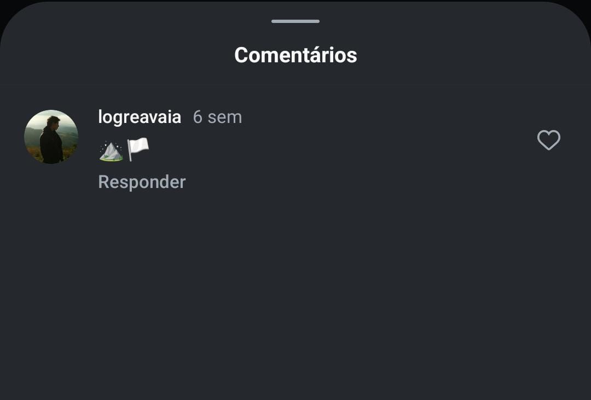

# O Mistério da Bandeira Perdida

> Há algum tempo, um jovem aspirante à HawkSec surgiu nas sombras da comunidade. Inteligente, curioso e com um faro afiado para os detalhes, ele parecia destinado a se tornar um dos nossos. Mas então... ele sumiu.
Antes mesmo do fim do processo seletivo, ele desapareceu sem deixar rastro. Ou pelo menos, era o que todos pensavam.
Não levou só seu caderno de anotações.
Nem apenas seu moletom surrado.
Levou algo mais.
Levou a bandeira da HawkSec.
Desde então, estranhos rastros foram notados. Comentários antigos surgindo em nossas postagens, conexões que ninguém lembra de ter feito, mensagens cifradas perdidas no meio do feed. Ele deixou sinais. Mas por quê?
Sua última publicação parecia só mais um desabafo melancólico, falando sobre uma caminhada solitária pelas montanhas. Mas lendas urbanas da equipe dizem que, toda mensagem, se lida com atenção, pode esconder pistas.
Agora o que todos querem saber: onde está a bandeira da HawkSec?  
Formato da flag: hawk{Nome_do_Local}

- **Autora:** [@Ana Luiza Oliveira](https://github.com/Ana-Luiza-Oliveira)

Este é um desafio de osint e precisamos investigar as pistas dadas no texto para encontrar o que se pede. De forma geral, percebemos que precisamos encontrar a bandeira da HawkSec e que se trata de uma postagem em rede social. 

Vamos por partes:

O texto cita `"Comentários antigos surgindo em nossas postagens, conexões que ninguém lembra de ter feito, mensagens cifradas perdidas no meio do feed."` Isso nos leva a entender que há algum comentário em alguma publicação no instagram da HawkSec. 

Analisando o instagram, podemos verificar todas as postagens em busca de algum comentário suspeito, mas o texto também nos direciona para posts específicos: `"Antes mesmo do fim do processo seletivo, ele desapareceu sem deixar rastro."` Observando as postagens sobre processo seletivo, encontramos um comentário suspeito fazendo referência a uma montanha e uma bandeira, também citados no texto, em uma publicação de 2024: 

Investigando tal perfil, `logreavaia`, nos deparamos com uma publicação com a bandeira da HawkSec com as seguintes imagens:

e a seguinte legenda: `"Tem lugares que a gente nunca esquece…
Subi esse pico achando que era só mais uma trilha, mas no topo percebi que era um marco na minha jornada.
Levei meu caderno de anotações, meu velho moletom da faculdade e uma garrafa de café. Achei que, se me sentisse livre, talvez encontrasse alguma resposta.
O sol começava a se esconder atrás das montanhas, pintando o céu com tons dourados e avermelhados. O vento uivava forte, como se quisesse me lembrar que ali, no alto da Mantiqueira, eu estava exatamente onde precisava estar.
Escrevi meu nome numa pedra e deixei uma pequena bandeira tremulando. Um gesto simples, mas carregado de significado. Só eu sei onde está.
Ali perto, uma formação curiosa parecia me observar — uma pedra redonda, solitária, como se tivesse sido deixada ali de propósito. Tinha algo de desafiador nela, como se dissesse: “resistir também é uma forma de crescer”.
Por um instante, olhei para a trilha à frente e me perguntei o que aconteceria se eu seguisse adiante. Dizem que há quem caminhe até onde o horizonte se dobra, onde outra montanha espera, impondo sua própria jornada. Mas naquele dia, minha travessia era outra.
A grande verdade é que há pistas por toda parte, esperando para serem decifradas - na natureza, nas cidades, nas pegadas esquecidas pelo tempo. Basta saber onde olhar.
E, naquele dia, com o vento no rosto e o horizonte infinito à minha frente, por alguns segundos, eu juro que enxerguei além."`

Agora precisamos encontrar o nome do pico que é citado na legenda. Vemos que foi publicado duas imagens de uma mesma pedra, se procurarmos por ela no Google, podemos encontrar os seguintes resultados:

Observando o primeiro site, o mesmo de onde a imagem postada foi tirada, encontramos a informação do pico onde a pedra também está localizada: `Pico dos Marins`. 

Observações:

O Pico dos Marins localiza-se na Serra da Mantiqueira, citada no trecho `"O vento uivava forte, como se quisesse me lembrar que ali, no alto da Mantiqueira, eu estava exatamente onde precisava estar."`

O texto faz referência ao próprio nome da pedra, Pedra Redonda, no seguinte trecho: `"Ali perto, uma formação curiosa parecia me observar — uma pedra redonda, solitária, como se tivesse sido deixada ali de propósito."`

O trecho `"Por um instante, olhei para a trilha à frente e me perguntei o que aconteceria se eu seguisse adiante. Dizem que há quem caminhe até onde o horizonte se dobra, onde outra montanha espera, impondo sua própria jornada. Mas naquele dia, minha travessia era outra"` faz referência à trilha da Travessia Marins x Itaguaré. 

Flag: `hawk{Pico_dos_Marins}`