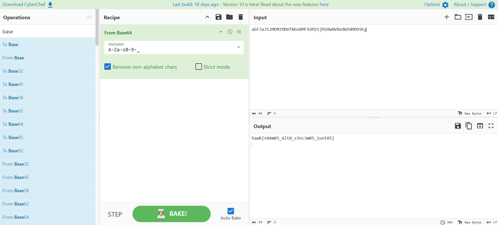

# O Segredo do Falcão

> Há rumores de que a HawkSec tem um mensageiro secreto - um falcão astuto que voa entre as sombras levando informações valiosas. Mas este falcão não compartilha seu segredo com qualquer um! Dizem que sua mensagem está protegida, oculta de olhos despreparados e disfarçada para evitar que caia nas mãos erradas. Apenas os mais perspicazes poderão rastrear suas pistas, juntar os fragmentos e revelar o que está sendo guardado.

- **Autora:** [@Ana Luiza Oliveira](https://github.com/Ana-Luiza-Oliveira)

Baixando o arquivo `hawk.jpg`, temos a seguinte imagem:


Como o desafio é da categoria Esteganografia e texto nos sugere que há algo oculto e protegido, podemos verificar se há arquivos escondidos na imagem utilizando binwalk: 


Percebemos que há um arquivo zip escondido na imagem. Vamos extrair usando o seguinte comando: 

```
binwalk -e hawk.jpg
```

Ao abrir a pasta extraída, encontramos um arquivo zip protegido com senha: 


Analisando os metadados do arquivo `hawk.jpg`, encontramos a linha `Commented - Senha: h4wk`.


Esta senha permite extrair o zip e nos leva a um arquivo txt com uma mensagem criptografada: 


Podemos decodificar usando o [CyberChef](https://gchq.github.io/CyberChef/), que nos sugere base64:



Flag: `hawk{v04m05_4lt0_v3nc3m05_1unt05}`