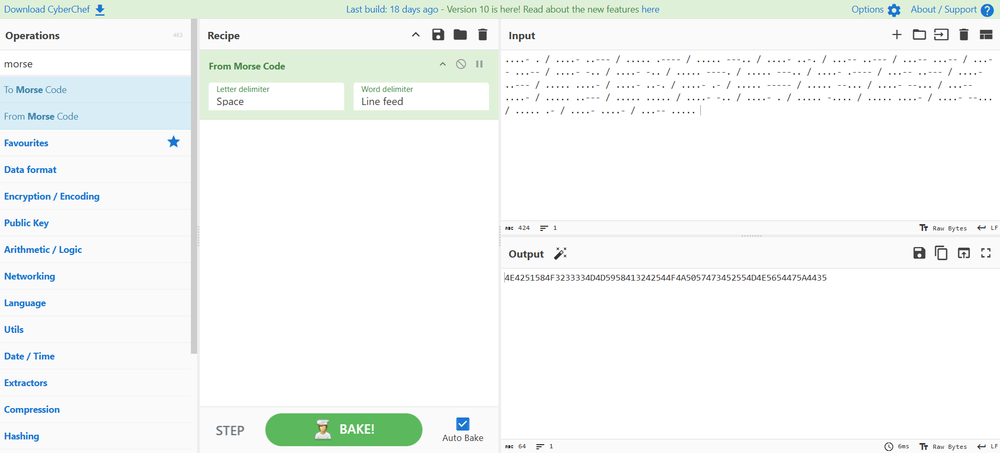
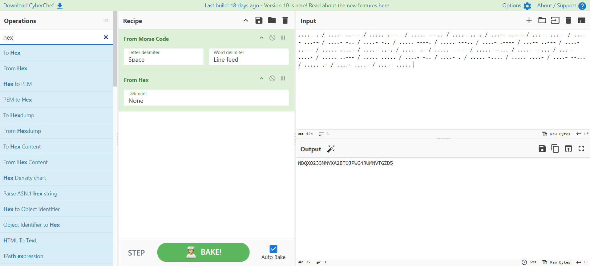
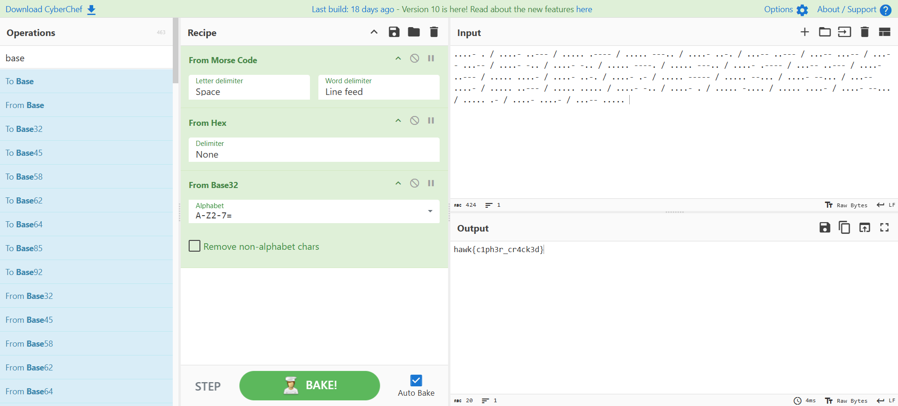

# Três Camadas de Paranoia

> — “Você conhece a Regra dos Três?”  
“Três camadas para esconder, três filtros para confundir, três barreiras entre a mente e a verdade...”  
Esse bilhete misterioso foi encontrado preso com um clips enferrujado no caderno de um antigo membro da HawkSec. Ao lado dele, uma mensagem enigmática em código:  
....- . / ....- ..--- / ..... .---- / ..... ---.. / ....- ..-. / ...-- ..--- / ...-- ...-- / ...-- ...-- / ....- -.. / ....- -.. / ..... ----. / ..... ---.. / ....- .---- / ...-- ..--- / ....- ..--- / ..... ....- / ....- ..-. / ....- .- / ..... ----- / ..... --... / ....- --... / ...-- ....- / ..... ..--- / ..... ..... / ....- -.. / ....- . / ..... -.... / ..... ....- / ....- --... / ..... .- / ....- ....- / ...-- .....  
Você é capaz de decifrar a mensagem?

- **Autora:** [@Ana Luiza Oliveira](https://github.com/Ana-Luiza-Oliveira)

Como a mensagem apresenta pontos e traços, percebemos que se trata do Código Morse. Podemos decodificar usando o [CyberChef](https://gchq.github.io/CyberChef/):

Obtemos a seguinte saída: `4E4251584F3233334D4D5958413242544F4A5057473452554D4E5654475A4435`.

Ao observar números de 0 a 9 e letras de A a F, vemos que se trata de uma codificação em hexadecimal. Usando o CyberChef: 

Obtemos a saída: `NBQXO233MMYXA2BTOJPWG4RUMNVTGZD5`.

Pode-se desconfiar que se trata de uma codificação utilizando alguma base. Como não é possível se certificar, podemos realizar várias tentativas ou utilizar o método automático do CyberChef, que nos sugeriu estar em Base32:

Flag: `hawk{c1ph3r_cr4ck3d}`
