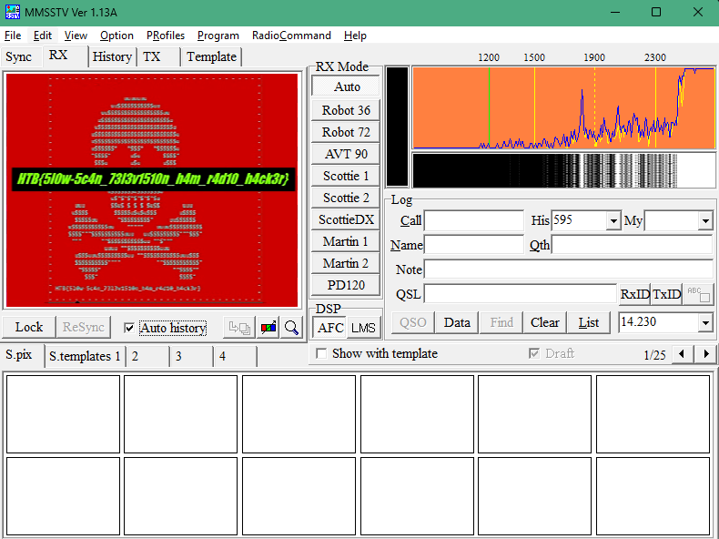

# Write-Up: Signals

## Descrição do Desafio

**Nome:** Signals  
**Plataforma:** Hack The Box  
**Categoria:** Hacking  
**Dificuldade:** Fácil  
**Data:** Novembro/2024

**Descrição do desafio:** 

>Neste desafio, é fornecido um áudio que contém uma mensagem criptografada. O objetivo é descriptografar essa mensagem oculta e descobrir a flag. Para isso, usaremos o aplicativo **MMSSTV** para analisar o espectrograma e capturar uma imagem no formato SSTV (Slow Scan Television). No entanto, para evitar interferências, precisamos isolar o áudio no sistema, usando o **VB-Audio Virtual Cable** como canal de áudio dedicado, e o **VLC** para reproduzir o áudio e direcionar a saída ao canal apropriado.

---

## Passo a Passo da Solução

### 1. Análise Inicial
- **Arquivo/Entrada:** O arquivo de entrada fornecido é um áudio: [`Signal.wav`](/Signal.wav).
- **Ferramentas Utilizadas:** Para resolver o desafio, foram utilizadas as seguintes ferramentas:
    - **VLC**: Reprodutor de mídia para tocar o áudio.
    - **VB-Audio Virtual Cable**: Um driver de áudio virtual que permite isolar a saída do áudio.
    - **MMSSTV**: Software que captura imagens SSTV (Slow Scan Television) a partir do espectrograma do áudio.

### 2. Configuração das Ferramentas

Para decodificar a mensagem, precisamos configurar corretamente as ferramentas:

2.1. **Instalação dos Softwares**  
   - Baixe e instale o **VLC**, **VB-Audio Virtual Cable**, e o **MMSSTV**.  
   - Links para download:
       - [VLC Media Player](https://www.videolan.org/)
       - [VB-Audio Virtual Cable](https://vb-audio.com/Cable/)
       - [MMSSTV](https://hamsoft.ca/pages/mmsstv.php)

2.2. **Configuração de Áudio no VLC**
   - Abra o VLC e vá até o menu superior:
     - **Áudio** > **Dispositivo de Áudio** > selecione **CABLE In 16 Ch (VB-Audio Virtual Cable)**.

   

2.3. **Configuração de Áudio no MMSSTV**
   - No MMSSTV, vá até o menu superior:
     - **Option** > **Setup MMSSTV(0)...**
   - Na janela de configuração, selecione a aba **Misc** e, na seção **Sound Card**, defina a entrada de áudio como **CABLE Output (VB-Audio Virtual Cable)**.

   

### 3. Decodificação da Imagem e Extração da Flag

- Após configurar as ferramentas, reproduza o áudio no VLC enquanto o MMSSTV decodifica o espectrograma.
- O MMSSTV interpretará os sinais SSTV e gerará uma imagem.
- Quando a imagem for completamente decodificada, ela exibirá a flag.

**Flag:**  
`HTB{5l0w-5c4n_73l3v1510n_h4m_r4d10_h4ck3r}`

---

## Referência

## Autor

