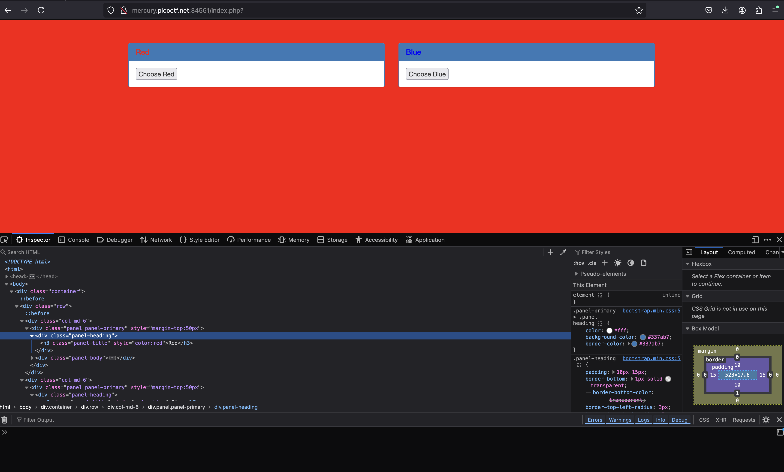
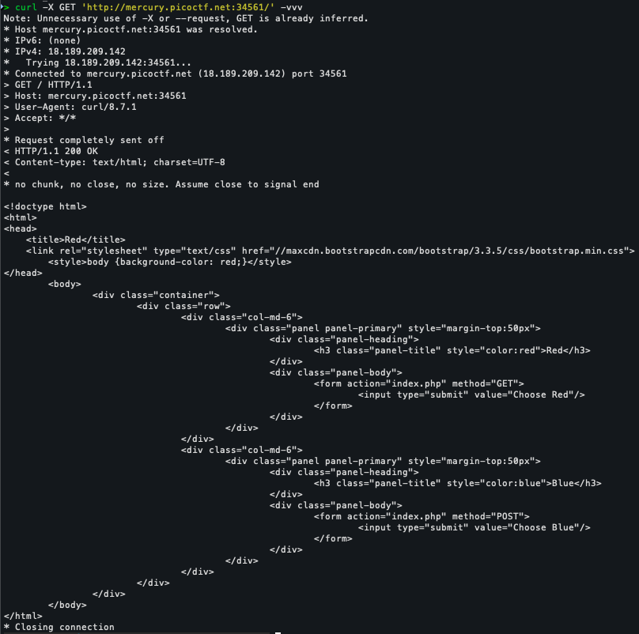
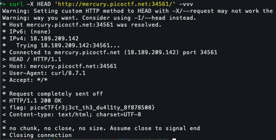

# PicoCTF: GET aHEAD

**Author**: madStacks \
**Plataforma**: PicoCTF\
**Categoria**: Web Exploitation\
**Dificuldade**: Facil\
**Descrição**: Find the flag being held on this server to get ahead of the competition http://mercury.picoctf.net:34561/


## Desafio

O desafio busca ensinar um pouco sobre o protocolo HTTP, atravez de um servidor Web no qual possui alguns metodos que expoem alguns Headers onde pode se encontrar a flag.

---

## Solução

### 1. Análise inicial

Ao acessar o site, vemos uma pagina web que apenas tem dois botoes que mudam o background-color da pagina, ao inspecionar a pagina nada foi encontrado.



---

### 2. Explorando a requisicao com o cURL

Para ver mais detalhadamente e com mais facilidade, resolvi usar o comando **cURL** para fazer a requisicao. Utilizar os parametros **-vvv** para aumentar o nivel de verbosidade do comando.

```
curl http://mercury.picoctf.net:34561/ -vvv
```

Esse comando nao retornou nada muito interessante, apenas o conteudo do site e outras informacoes nao muito uteis:



Porem, ao analisar a descricao do desafio e o titulo, pensei em testar outros metodos HTTP, primeiramente o HEAD, ja que esta evidenciado no titulo do desafio.

```
curl -X HEAD 'http://mercury.picoctf.net:34561/' -vvv
```

Agora ao analisar a resposta do servidor:



Podemos o Header **flag** na resposta, lembre-se que nao e comum esse Header.

### 3. Flag

```
picoCTF{r3j3ct_th3_du4l1ty_8f878508}
```

---

## Autor da WriteUp

[Membro de Networking - leandrobalta](https://github.com/leandrobalta)