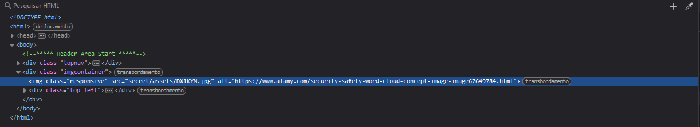
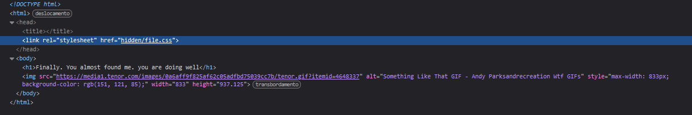

# Writeup - Secrets Challenge

## Descrição do desafio
**Author**: Geoffrey Njogu \
**Plataforma**: [PicoCTF](https://play.picoctf.org/practice/challenge/296?category=1&difficulty=2&page=1) \
**Categoria**: Web Exploitation \
**Dificuldade**: Médio \
**Data**: 2022 


---

## Descrição do Desafio

No desafio, foi dada a seguinte dica:  
**"folders folders folders"**

O site fornecido é:  
`http://saturn.picoctf.net:61871/`

Ao acessar o site, visualmente não há nada útil para ser analisado. A solução exige inspeção no HTML e exploração de diretórios.

---

## Solução

### Passo 1: Analisando o HTML inicial

Ao inspecionar o HTML da página inicial, encontramos uma referência a uma imagem:



```html

```

Removendo a parte do caminho que aponta para a imagem, obtemos um novo diretório:  
`http://saturn.picoctf.net:61871/secret/`

Acessando essa URL, encontramos a mensagem:

> Finally. You almost found me. you are doing well

Não há nada útil visível, mas ao inspecionar o código fonte do HTML, encontramos outra referência suspeita:



```html
<link rel="stylesheet" href="hidden/file.css">
```

---

### Passo 2: Explorando o próximo diretório

Removendo o `file.css` do caminho, obtemos um novo diretório:  
`http://saturn.picoctf.net:61871/secret/hidden/`

Ao acessar esta URL, novamente não há nada útil visualmente. Porém, ao inspecionar o código fonte, encontramos outra referência:


```html
<link href="superhidden/login.css" rel="stylesheet">
```

---

### Passo 3: Explorando o diretório final

Removendo o `login.css` do caminho, obtemos um novo diretório:  
`http://saturn.picoctf.net:61871/secret/hidden/superhidden/`

Ao acessar esta URL, encontramos a seguinte mensagem:

> Finally. You found me. But can you see me

Inspecionando o código fonte do HTML, encontramos a flag escondida:

```html
<h3 class="flag">picoCTF{succ3ss_@h3n1c@10n_790d2615}</h3>
```

```css
.flag {
  background-color: white;
  color: white;
}
```

A flag utiliza a mesma cor do fundo da página, tornando-a invisível no site sem a inspeção do código.

---

## Flag

A flag encontrada é:  
**`picoCTF{succ3ss_@h3n1c@10n_790d2615}`**

---

## Conclusão

Este desafio destacou a importância de explorar a estrutura de diretórios e inspecionar o código fonte de páginas web. Cada etapa exigiu identificar e acessar diretórios ocultos para, finalmente, encontrar a flag.

---

## Recursos Utilizados

- Navegador e ferramentas de inspeção (DevTools)
- Observação e exploração de padrões em URLs e diretórios

**Flag Final:** `picoCTF{succ3ss_@h3n1c@10n_790d2615}`

## Autor da WriteUp
[Membro de Networking - gabrielhdsalves](https://github.com/gabrielhdsalves)