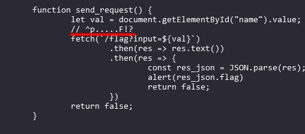

# PicoCTF: Match the Regex Writeup

**Author**: Sunday Jacob Nwanyim \
**Plataforma**: PicoCTF\
**Categoria**: Web Exploitation\
**Dificuldade**: Média

## Desafio

O desafio "Match the Regex" no PicoCTF exige que você descubra um texto que corresponda a um padrão específico baseado em uma expressão regular.

---

## Informações fornecidas

1. **Pista no console**:

   - O texto deve começar com a letra **p**.
   - Deve terminar com a letra **F**.
   - Deve conter **cinco letras entre** a primeira e a última letra.

2. Com essas informações, o padrão pode ser descrito como:

   - `pXXXXXF`, onde `X` representa qualquer letra.



---

## Solução

Testando o exemplo `picoctF`, verificamos que ele corresponde ao padrão e resolve o desafio. Ao submeter o input, obtemos a flag correta:

```
picoCTF{succ3ssfully_matchtheregex_08c310c6}
```

## Autor da WriteUp

[Membro de Exploitation - jvittor1](https://github.com/jvittor1)
