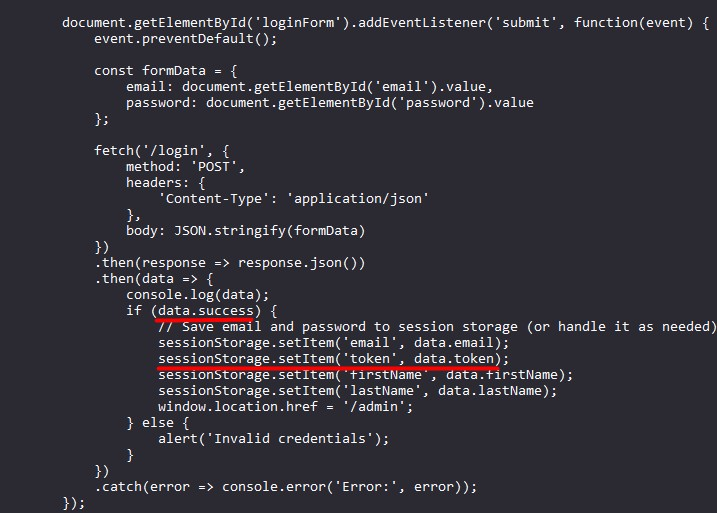
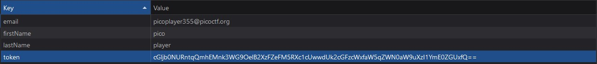

# PicoCTF: No SQL Injection

**Author**: NGIRIMANA Schadrac \
**Plataforma**: PicoCTF\
**Categoria**: Web Exploitation\
**Dificuldade**: Média

## Desafio

Este desafio explora uma vulnerabilidade de NoSQL Injection para obter acesso ao sistema sem credenciais válidas. O objetivo principal é encontrar a flag utilizando NoSQL Injection.

---

## Solução

### 1. Análise inicial

Ao acessar o site, foi identificado um formulário de login que solicita **email** e **senha**.

No console do navegador, é exibida uma mensagem indicando que, após um login bem-sucedido, um token será armazenado no `localStorage`.



---

### 2. Explorando a vulnerabilidade de NoSQL Injection

#### Objetivo:

Efetuar o login sem fornecer credenciais válidas, explorando uma vulnerabilidade de NoSQL Injection.

#### Exemplos de NoSQL Injection:

1. **Utilizando `$ne` (not equal):**

   - Email:
     ```json
     { "$ne": null }
     ```
   - Senha:
     ```json
     { "$ne": null }
     ```
     Esse payload ignora qualquer validação ao verificar que o valor não é nulo.

2. **Usando `$gt` (maior que):**

   - Email:
     ```json
     { "$gt": "" }
     ```
   - Senha:
     ```json
     { "$gt": "" }
     ```
     Permite valores que sejam "maiores" do que uma string vazia, efetivamente ignorando verificações.

3. **Forçando condições verdadeiras com `$or`:**
   - Email:
     ```json
     { "$or": [{ "admin": true }, { "email": { "$ne": null } }] }
     ```
   - Senha:
     ```json
     { "$ne": null }
     ```
     Esse payload verifica múltiplas condições, aceitando o login se uma delas for verdadeira.

#### No desafio foi utilizado:

No campo **email**:

```json
{ "$ne": "null" }
```

E no campo **senha**:

```json
{ "$ne": "null" }
```

Essa abordagem foi bem-sucedida e confirmou a vulnerabilidade do sistema.

---

### 3. Recuperando o token

Após o login bem-sucedido, um token é armazenado no `localStorage`. Para acessá-lo:

1. Abra o console do navegador.
2. Navegue até a aba **Application**.
3. No menu lateral, vá para **Storage > Local Storage**.
4. Localize o token armazenado.



---

### 4. Decodificando o token

O token encontrado está em formato **Base64**. Para decodificá-lo:

1. Copie o token.
2. Utilize uma ferramenta ou método para decodificação Base64.

---

### 5. Flag

Após decodificar o token, a flag será exibida no formato:

```
picoCTF{jBhD2y7XoNzPv_1YxS9Ew5qL0uI6pasql_injection_25ba4de1}
```

---
