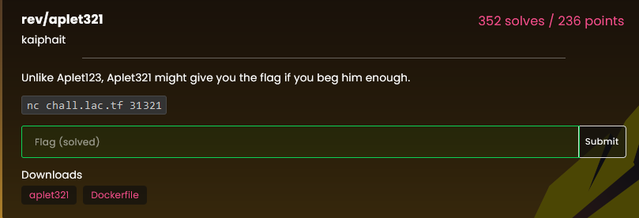
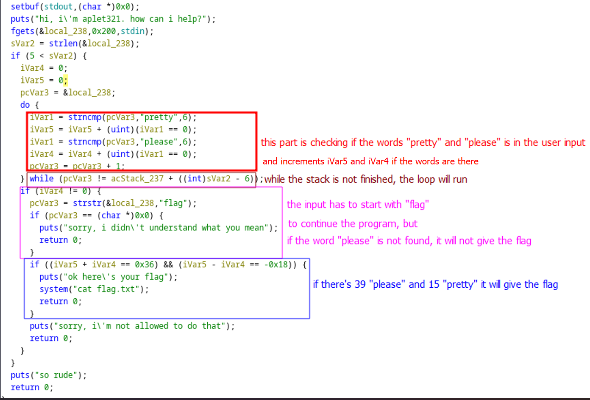
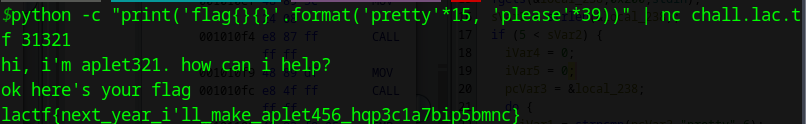

# aplet321

The challenge description:



Analyzing the binary file using ghidra, we can find this code in the main function:



So, we created this bash command, to get the flag:

```bash
python -c "print('flag{}{}'.format('pretty'*15, 'please'*39))" | nc chall.lac.tf 31321
```

The output using this code in the terminal is:



`lactf{next_year_i'll_make_aplet456_hqp3c1a7bip5bmnc}`
