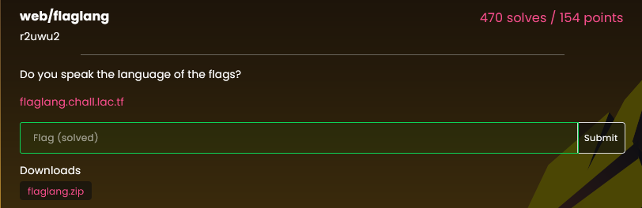
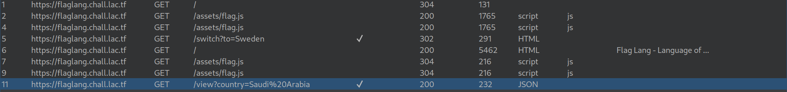
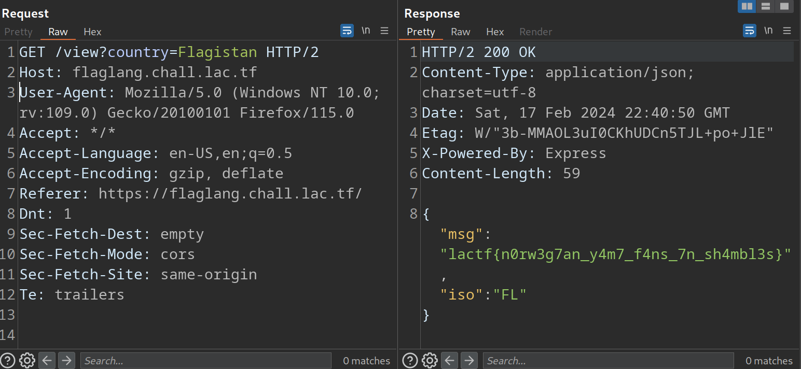

# web/flaglang

The challenge is the following:



It gives you a link to the website the source code

The website looks like this:


And the source code is this:


If you see inside the `countries.yaml` file you will see the flag at the beggining

```yaml
Flagistan:
  iso: FL
  msg: "<REDACTED>"
  password: "<REDACTED>"
```

So you will need to select this option on the website to obtain the flag
but that option doesn't exists in the website

When you use burp to analyse how the site works, you will se the following history:



And you can see that you can change the flag by tipying the name of the country you want in the url,
`https://flaglang.chall.lac.tf/view?country=Saudi%20Arabia`, so if you send the package to the repeater and change the country to `Flagistan` you will see the following error:


This happens because `Flagistan` has a embargo on every country

On the source code, the resolution for the request is solved by the following code:

```javascript
app.get('/view', (req, res) => {
  if (!req.query.country) {
    res.status(400).json({ err: 'please give a country' });
    return;
  }
  if (!countries.has(req.query.country)) {
    res.status(400).json({ err: 'please give a valid country' });
    return;
  }
  const country = countryData[req.query.country];
  const userISO = req.signedCookies.iso;
  if (country.deny.includes(userISO)) {
    res.status(400).json({ err: `${req.query.country} has an embargo on your country` });
    return;
  }
  res.status(200).json({ msg: country.msg, iso: country.iso });
});
```

So it's checking where you came from based on the cookie, then if you erase the cookie from the Repeater, you get the Flag!



`lactf{n0rw3g7an_y4m7_f4ns_7n_sh4mbl3s}`
