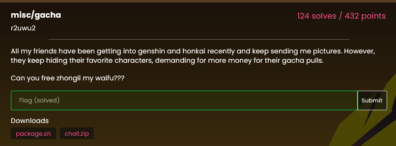
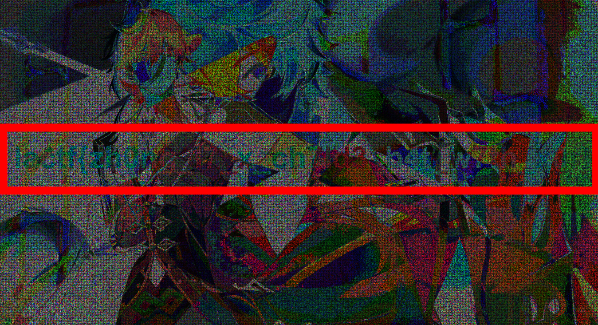

# Gacha

challenge description:

The gacha challenge gives three images, one of the character pull splash art Fischl, and two noise images.
Fischl image exist to trick you into searching the player profile by its UID. But you just have to use a tool that sees the difference between the images, such as [site](https://www.diffchecker.com/image-compare/)

Fischl:

You simply insert the two images in the placeholders and press the button "difference".
An image of inverted colors childe from Genshin will appear, with the flag on it (although its quite hard to read).

`lactf{zh0ng_l7_x_ch7ld3_b4t_w7th_x0r}`
