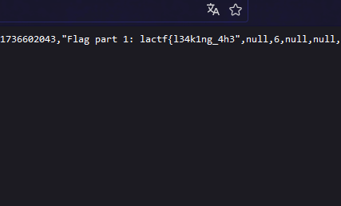
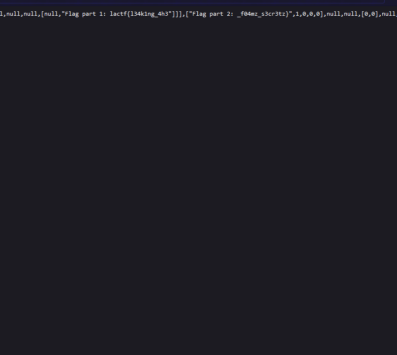

# infinite loop

Challenge description:

For this challenge you need to inspect the source code of the website provided:

It will redirect to this:

If you search for `lactf{` you will find the first part of the flag:

`lactf{l34k1ng_4h3`

If you scroll a little, you will se the second and last part:

`_f04mz_s3cr3tz}`

Putting the two parts together we get the flag:

`lactf{l34k1ng_4h3_f04mz_s3cr3tz}`
