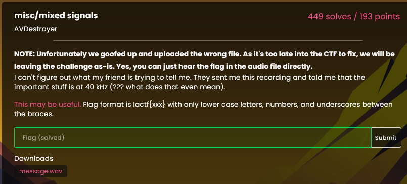

# mixed signals

challenge description:



The challenge has an audio file attached, with a man saying the phonetic alphabet and a couple of symbols after. The description has a hint that important stuff is at 40khz. Then if you've studied telecomunications you can tell its a type of wave modulation, this case a amplitude modulation.

Im using octave here, and used this code to perform a simple amplitude modulation:

```c++
% Define chunk size (adjust as needed)
chunk_size = 8192;
carrier_frequency = 40000; % Hz
% Modulation depth (adjust as needed)
modulation_depth = 0.5;

% Open input and output audio files
input_file = 'misc_mixed-signals_message.wav';
output_file = 'output_modulated.wav';
input_info = audioinfo(input_file);
output_fs = input_info.SampleRate;

% Create time vector for output file
t_output = (0:input_info.TotalSamples-1) / output_fs;

% Create an output signal variable
modulated_signal = zeros(input_info.TotalSamples, 1);

% Process audio data in chunks
for i = 0:chunk_size:input_info.TotalSamples-chunk_size
    % Read a chunk of audio data
    start_sample = i + 1;
    end_sample = min(i + chunk_size - 1, input_info.TotalSamples); % Adjusted end_sample
    [input_wave, fs] = audioread(input_file, [start_sample, end_sample]);

    % Create time vector for the chunk
    t_chunk = t_output(start_sample:end_sample);

    % Generate carrier signal for the chunk
    carrier = sin(2 * pi * carrier_frequency * t_chunk);

    % Perform amplitude modulation for the chunk
    modulated_chunk = (1 + modulation_depth * input_wave) .* carrier;

    % Determine the length of the current chunk
    chunk_length = length(modulated_chunk);

    % Store the modulated chunk in the output signal
    modulated_signal(start_sample:end_sample) = modulated_chunk(1:chunk_length);
end

% Normalize the modulated signal to stay within the range of -1 to 1
modulated_signal = modulated_signal / max(abs(modulated_signal));

% Write the modulated signal to the output .wav file
audiowrite(output_file, modulated_signal, output_fs);

disp(['Amplitude modulated signal saved as ' output_file]);
```

Then the modulated file will be generated in the same folder (it might take a couple seconds to finish). You can hear the man now saying the phonetic alphabet in an order now, it is the flag:

`lactf{c4n_y0u_plz_unm1x_my_s1gn4lz}`

The generated file has an annoying noise, its hard to hear on the first attempt, specially the first 4, but after a few tries you can hear it.
