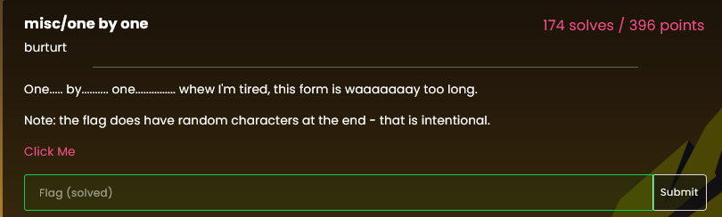
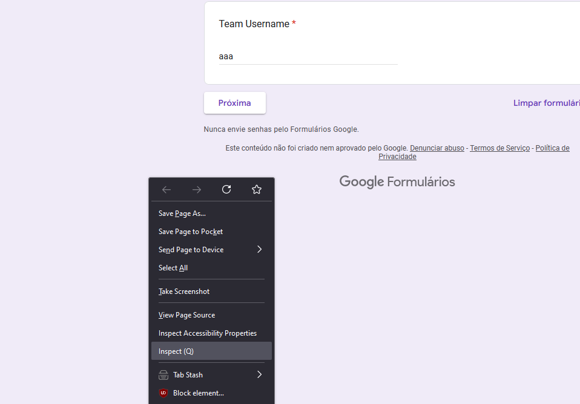

# One by one

Challenge description:

This has the same principle of the infinite loop, we need to see the page source:

If we take a closer look we will find a array with all the answers, we used a [website](https://codebeautify.org/c-formatter-beautifier/cb14b18a#) to format the array to make easier to see:

You can notice that the letter `l` has a different value than the others, and is the first letter of the flag, so if you follow this logic and get all the letters, you will be able to get the flag:

`lactf{1_by_0n3_by3_un0_*,"g1'}`
