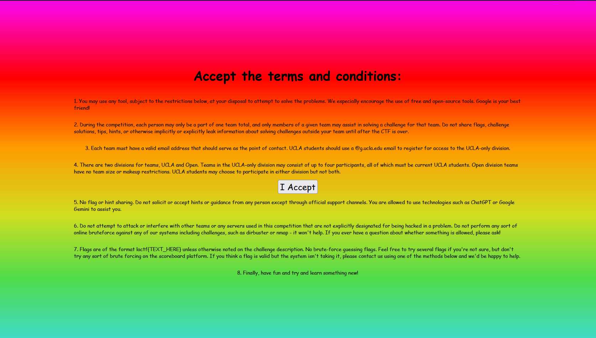
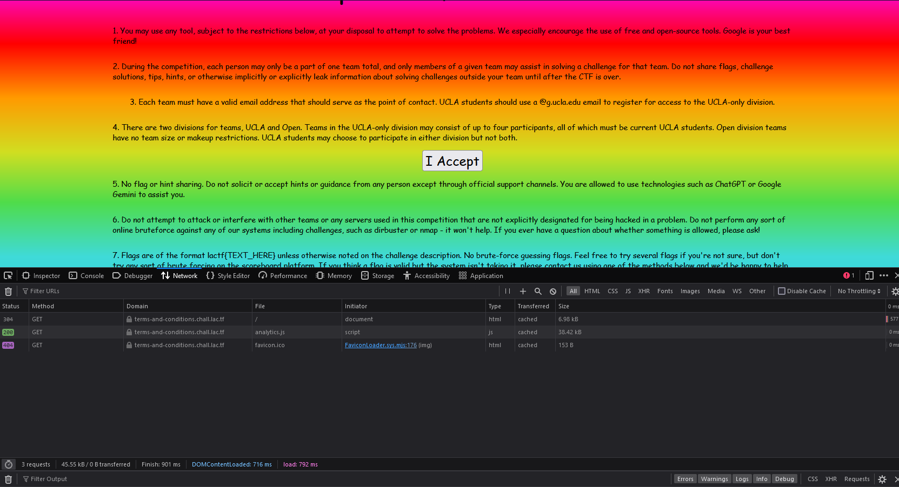
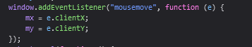
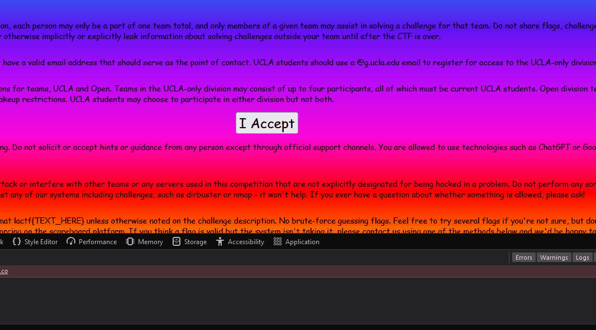

# terms-and-conditions

Challenge description:


When you access the link, you see the following page:



And if you try to click the `I Accept` button, he goes away


The problem is, if you open the console the website will break:


But if you update the page with the console open, it doesn't break



analyzing the code, you will see the following code:



which you can change on the console for this:

```javascript
window.addEventListener("mousemove", function (e) {
    mx = 0;
    my = 0;
});
```

This will let you click the button, because it's not tracking your mouse anymore



`lactf{that_button_was_definitely_not_one_of_the_terms}`
